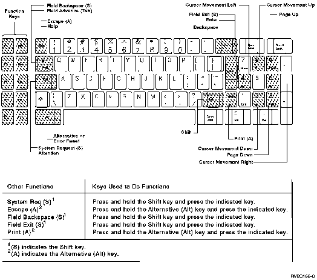
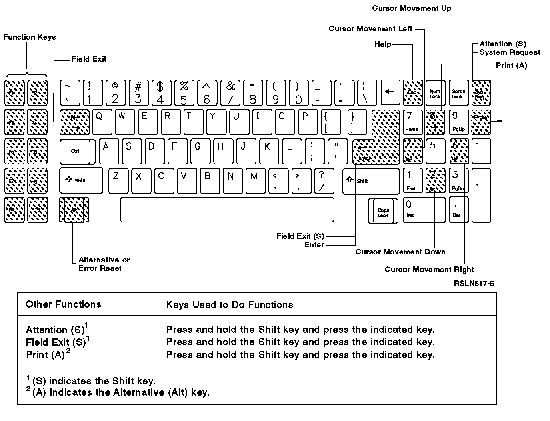

[Previous](e-4.md) | [Index](README.md) | [Next](e-4-2.md)

---

#### E\.4\.1 Using a Personal Computer or Personal Computer AT Style Keyboard

Using the work station function, you can have a personal computer keyboard emulate or act like a personal computer style keyboard as shown below\.

*Figure E\-4\. Using the Work Station Function in PC Style on a PC Keyboard\.*

Using the work station function, you can have a Personal Computer AT keyboard emulate or act like a Personal Computer AT style keyboard as shown below\.

*Figure E\-5\. Using the Work Station Function in AT Style on an AT Keyboard\.*

For personal computer style keyboards and Personal Computer AT style keyboards, do the following to use function keys 1 through 10 \(F1 through F10\):

Press the function key that corresponds to the number you want to use\.

To use function keys 11 through 20 \(F11 through F20\): 1\. Press and hold the Shift key\.

2\. Press the function key that corresponds to the number you want to use\. For example, F1 is used as F11, F2 is used as F12, F10 is used as F20, and so on\.

To use function keys 21 through 24 \(F21 through F24\): 1\. Press and hold the Alternative \(Alt\) key\.

2\. Press the function key that corresponds to the number you want to use\. For example, F1 is used as F21, F2 is used as F22, F3 is used as F23, and F4 is used as F24\.

---

[Previous](e-4.md) | [Index](README.md) | [Next](e-4-2.md)
