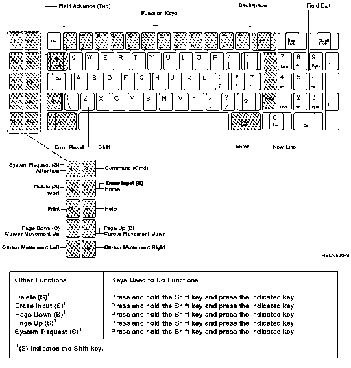
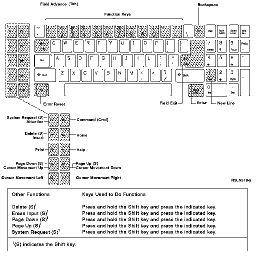

[Previous](e-4-1.md) | [Index](README.md) | [Next](e-4-3.md)

---

## E.4.2 Using a Personal Computer or Personal Computer AT 5250 Style Keyboard

#### Using a Personal Computer or Personal Computer AT 5250 Style Keyboard

Using the work station function, you can have a personal computer keyboard emulate or act like a 5250 keyboard as shown below.

Figure E-6. Using the Work Station Function in 5250 Style on a PC, Keyboard.

, c.cp Using the work station function, you can have a Personal Computer AT keyboard emulate or act like a 5250 keyboard as shown below.

Figure E-7. Using the Work Station Function in 5250 Style on an Personal Computer AT Keyboard.

To use function keys 1 through 12 (F1 through F12): 1. Press and release the F2 key. 2. Press the top row key that corresponds to the number of the desired function key. For example, 1 is used as F1, 2 is used as F2, 0 is used as F10, the - (minus) key is used as F11, and the = (equal) key is used as F12. To use function keys 13 through 24 (F13 through F24):

used as F22, the - (minus) key is used as F23, and the = (equal) key is used as F24.

---

[Previous](e-4-1.md) | [Index](README.md) | [Next](e-4-3.md)
