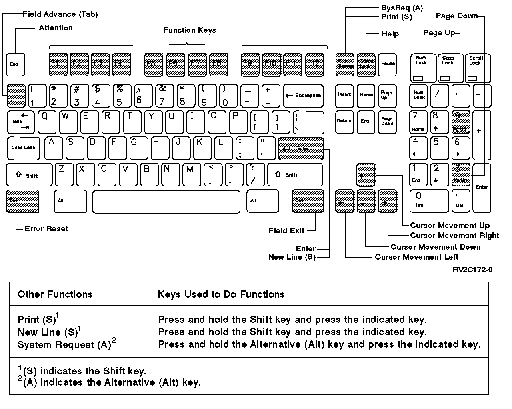

[Previous](e-4-2.md) | [Index](README.md) | [Next](e-5.md)

---

## E.4.3 Using an IBM-Enhanced Personal Computer Keyboard

#### Using an IBM-Enhanced Personal Computer Keyboard

Shown below is the IBM-enhanced personal computer keyboard.

Figure E-8. Using the Work Station in PC Style on an Enhanced PC Keyboard.

Shift 1. Press and hold the Shift key. 2. Press the top row key that corresponds to the number of the desired key. For example, the F1 key is used as F13, the F2 key is used as F14, the F3 key is used as F15, and the F12 key is used as F24.

---

[Previous](e-4-2.md) | [Index](README.md) | [Next](e-5.md)
