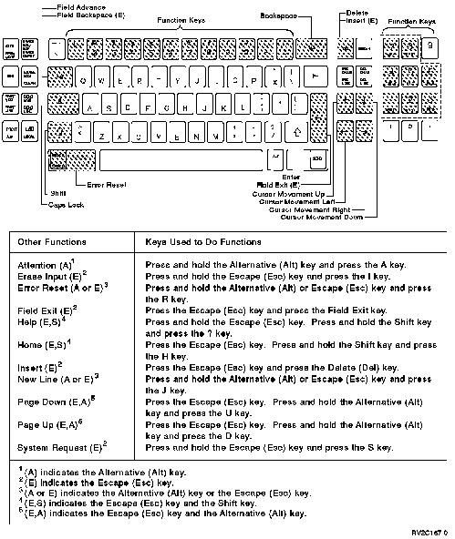

[Previous](e-5.md) | [Index](README.md) | [Next](e-5-2.md)

---

## E.5.1 Using the 3101 ASCII Keyboard

The 3101 ASCII keyboard is shown below.

Figure E-9. Work Station Function with the 3101 ASCII Keyboard.

, c.cp To use function keys 1 through 8 on the 3101 keyboard, do one of the following: Press and hold the Escape (Esc) key and the appropriate top row key on the keyboard. For example, the 1 key is used as function key 1, the 2 key is used as function key 2, the 3 key is used as function key 3, and the 8 key is used as function key 8. Press and hold the Alternative (Alt) key and the appropriate key number (1 through 8) on the numeric key pad located on the right side of the keyboard. For example, the 1 key is used as function key 1, the 2 key is used as function key 2, the 3 key is used as function key 3, and the 8 key is used as function key 8. To use function keys 9 through 12: 1. Press and hold the Escape (Esc) key. 2. Press the appropriate function key located at the top of the keyboard. For example, the 9 key is used as function key 9, the 0 key is used as function key 10, the - (minus) key is used as function key 11, and the = (equal) key is used as function key 12. To use function keys 13 through 24: 1. Press the Escape (Esc) key. 2. Press and hold the Shift key. 3. Press the appropriate top row function key. For example, the 1 key is used as function key 13, the 0 key is used as function key 22, the (minus) key is used as function key 23, and the = (equal) key is used as function key 24.

---

[Previous](e-5.md) | [Index](README.md) | [Next](e-5-2.md)
