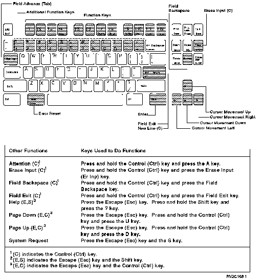

[Previous](e-5-2.md) | [Index](README.md) | [Next](e-5-2-2.md)

---

#### E.5.2.1 3151 ASCII Keyboard Without Numeric Key Pad

The 3151 ASCII keyboard without a numeric key pad is shown below.

Figure E-10. Work Station Function on 3151 ASCII Keyboards without Key Pad.

To use function keys 1 through 12 without a numeric key pad: Press the appropriate function key located at the top of the keyboard. To use function keys 13 through 24 without a numeric key pad: 1. Press the Escape (Esc) key twice. 2. Press the Shift key and the appropriate additional function key. These are located below function keys F1 through F12. For example, the 1 key is used as F13, the 2 key is used as F14, the 0 key is used as F22, the - (minus) key is used as F23, and the = (equal) key is used as F24.

---

[Previous](e-5-2.md) | [Index](README.md) | [Next](e-5-2-2.md)
