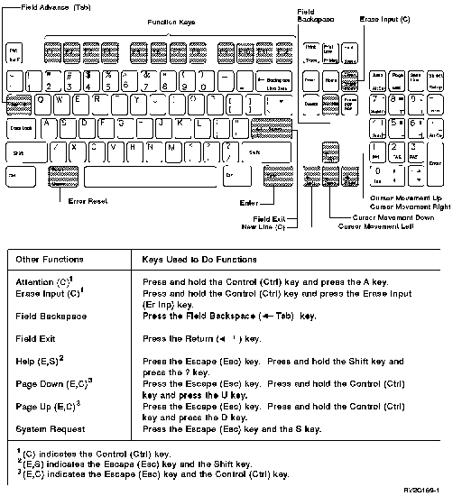

[Previous](e-5-2-1.md) | [Index](README.md) | [Next](e-5-3.md)

---

#### E\.5\.2\.2 3151 ASCII Keyboard with Numeric Key Pad

The 3151 ASCII keyboard with a numeric key pad is shown below\.

*Figure E\-11\. Work Station Function on 3151 ASCII Keyboards with a Key Pad\.*

To use function keys 1 through 12 with a numeric key pad \(F1 through F12\):

Press the appropriate function key located at the top of the keyboard\.

To use function keys 13 through 24 with a numeric key pad \(F13 through F24\):

1\. Press and hold the Shift key\.

2\. Press the appropriate function key\. For example, F1 is used as F13, F10 is used as F22, F11 is used as F23, and F12 is used as F24\.

---

[Previous](e-5-2-1.md) | [Index](README.md) | [Next](e-5-3.md)
