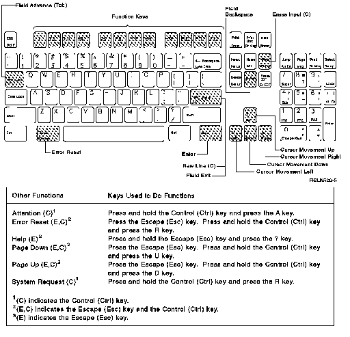

[Previous](e-5-2-2.md) | [Index](README.md) | [Next](e-6.md)

---

## E.5.3 Using the 3161 ASCII Keyboard

The 3160 ASCII keyboard is shown below.

Figure E-12. Work Station Function with the 3160 ASCII Keyboard.

---

[Previous](e-5-2-2.md) | [Index](README.md) | [Next](e-6.md)
