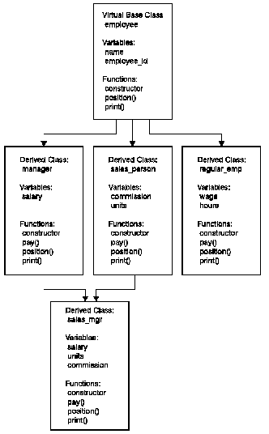
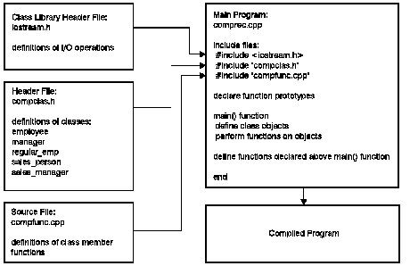

[Previous](1-1-4-1.md) | [Index](README.md) | [Next](1-1-4-3.md)

---

## 1.1.4.2 Program Structure

The program files are:

- A user-defined header file `compclas.h` containing the class declarations
- A C++ source file `compfunc.cpp` containing class member function definitions
- A C++ source file `comprec.cpp` containing the main program logic
- A system header file `iostream.h` from the Standard Class library containing standard input and output functions. User-Defined Header File

In the header file `compclas.h` five classes are declared:

- An abstract base class `employee` containing the employee's name and identification number
- & Three derived cla`sses ma`na`ger, regula`r_emp, `and sales_p`erson contain constructor functions and functions for printing out pay information
- A class `sales_mgr` that uses the `pay` functions from both the `sales_person` and `manager` classes in its pay function to demonstrate multiple inheritance.

Each class contains private data on salaries, or wages and hours worked, or commission and units sold, and on public functions that use the data. The class structure demonstrates the private and public aspects of a class. Each class contains one inlined function to demonstrate inlining within a class. [Figure 1](1.png) shows the class hierarchy.

Figure 1. Class Hierarchy in the Example Program

C++ Source Files

The file `compfunc.cpp` contains the definitions for the member functions of the classes used in this program.

The file `comprec.cpp` contains the logic for this program. It defines a function `payout()` that prints out a basic salary for each category of employee.

The function `payout()` demonstrates how you prototype and overload a function. Each class of employee has a different number of parameters, but the same function name is used for all employee classes. The functions are prototyped before the definition of the `main()` function. They are defined < in the bod`y of compre`c.cpp after the definition of `the m`ain() function.

<< `The` main() functi`on in compr`ec.cpp defines an instance of each of the four classes of employee: manager, sales manager, regular employee, and sales person, and uses the functions defined for each of these classes to display information about four typical employees. [Figure 2](2.png) shows the program structure.

Figure 2. Structure of the Example Program

---

[Previous](1-1-4-1.md) | [Index](README.md) | [Next](1-1-4-3.md)
