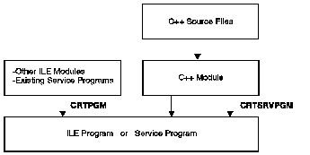

[Previous](1-2-1.md) | [Index](README.md) | [Next](1-2-3.md)

---

## 1\.2\.2 Creating a Program

ILE program creation consists of:

1. Compiling source code into modules
2. Binding \(combining\) one or more modules into a program object\.

You invoke the C\+\+ compiler through the `iccas` command\. By default this command compiles source code and binds modules into a program\. You can specify a compiler option to only create a module object\. A module object cannot be run as is; it must first be bound into a program object\.

You invoke the binder through a compiler option that includes the Create Program \(CRTPGM\) command\. The program results from binding the module\. You can run the program\.

Separate compiler options used for compiling source code and binding modules enable you to either reuse a module or update one module without recompiling other modules in the same program\. You can create and maintain mixed\-language programs because you can combine modules from any ILE language\.

You can create a *binding directory* to contain the names of modules and service programs that your ILE C\+\+ program or service program may need\. A binding directory can reduce program size because modules or service programs listed in a binding directory are used only if they are needed\.

You can bind modules into service programs \(`*SRVPGM`\)\. *Service programs* are a means of packaging callable routines \(functions or procedures\) into a separately bound program\. The use of service programs provides modularity and improves maintainability\. You can use off\-the\-shelf modules developed by third parties or package your own modules for third\-party use\. Service programs are created by a compiler option that includes the Create Service Program \(CRTSRVPGM\) command\.

[Figure 3](3.png) shows the process of creating an ILE program through compiler and binder invocation\.

*Figure 3\. Program Creation in ILE*

Once a program is created, you can update it using the Update Program \(UPDPGM\) or Update Service Program \(UPDSRVPGM\) commands\. These commands are useful, because you only need to have the new or changed modules available when you want to update the program\.

See the *C\+\+ User's Guide* for information on the compiler\.

---

[Previous](1-2-1.md) | [Index](README.md) | [Next](1-2-3.md)
