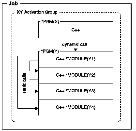

[Previous](1-3-3.md) | [Index](README.md) | [Next](1-3-3-2.md)

---

## 1.3.3.1 Single-Language ILE Programs

In ILE you can compile multiple C++ source files into modules and bind [FIGSCEN3](4.png) < them into a pro`g`ram Y which is called by an ILE C++ pro`g`ram X. Figure 4 [ shows the run-time view of such a single-language program.

Figure 4. Single-Language ILE C++ Program

> The call from pro`g`ra`m X (*P`GM(X)) to pro`g`ra`m Y (*P`GM(Y)) is a dynamic call. The calls among the modules in program `Y` (`Y1`, `Y2`, `Y3`, and `Y4`) are static calls.

---

[Previous](1-3-3.md) | [Index](README.md) | [Next](1-3-3-2.md)
