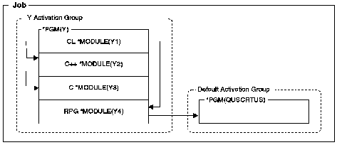

[Previous](1-3-3-1.md) | [Index](README.md) | [Next](1-3-3-3.md)

---

## 1.3.3.2 Mixed-Language ILE Programs

< In ILE, you can create a mixed-language program. The main module, written in one ILE language, can call procedures written in another ILE language. If you use different languages, you might not normally expect consistent behavior in the way your program handles calls, data, files, and errors. ILE was developed to ensure such consistency.

[Figure 5](5.png) shows the run-time view of an program containing a mixed-language ILE program in which one module calls a nonbindable API, `QUSCRTUS` (Create User Space).

< The call from pro`g`ram Y to the OPM `API (QUS`CRTUS) is a dynamic call. The calls among the modules in program `Y` are static calls.

Figure 5. Mixed-Language ILE Program Using CL, C++, C, RPG, and an API

---

[Previous](1-3-3-1.md) | [Index](README.md) | [Next](1-3-3-3.md)
