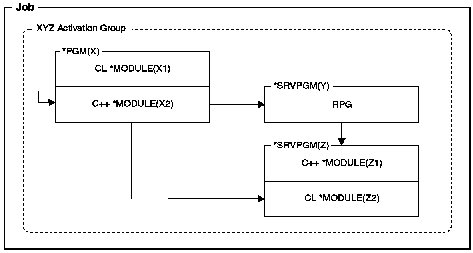

[Previous](1-3-3-2.md) | [Index](README.md) | [Next](1-3-3-4.md)

---

### 1\.3\.3\.3 ILE Programs that Contain Bound Service Programs

[Figure 6](6.png) shows the ILE program `X` calling two service programs `Y` and `Z`\. Service program `Z` contains frequently called functions within modules `Z1` and `Z2`\. The use of static procedure calls within modules and service programs provides improved performance, especially if the service program runs in the same activation group as the calling program\.

*Figure 6\. An ILE Program that Binds Two Service Programs*

The calls from program `X` to programs `Y` and `Z` are static calls\.

---

[Previous](1-3-3-2.md) | [Index](README.md) | [Next](1-3-3-4.md)
