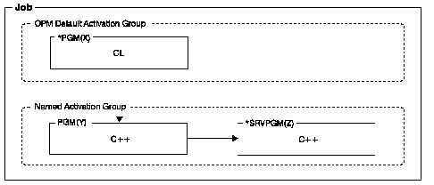

[Previous](1-3-3-3.md) | [Index](README.md) | [Next](2-1.md)

---

### 1\.3\.3\.4 OPM\-\-ILE Programs

ILE provides many alternatives for creating programs, but not all are equally easy to handle\. You should avoid a situation in which a program consisting of OPM and ILE programs is split across the OPM default activation group and a named ILE activation group, as shown in [Figure 7](7.png)\.

When you split programs across the OPM default activation group and any named activation group, you are mixing OPM behavior with ILE behavior\. Programs in the default activation group may be expecting the ILE programs to free their resources when the program ends\. These resources are not freed until the activation group ends\.

The scope of overrides and shared open data paths is more difficult to manage when a program is split between the default activation group and a named group\. By default, the scope for the named activation group is at the activation\-group level, but for the default activation group, the scope is either call level or job level, not activation\-group level\.

Under certain circumstances, you may need to run your OPM program in the default OPM activation group\. Run a new ILE program in a new activation group and a service program in the caller's activation group, to keep the overhead associated with frequent calls low, and avoid reinitialization of static variables\. To ensure correct program termination and the cleanup of associated storage, include a routine in your C\+\+ program that, when called by the OPM program, performs the `exit()` function and all necessary cleanup\.

---

[Previous](1-3-3-3.md) | [Index](README.md) | [Next](2-1.md)
