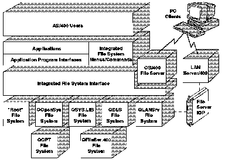

[Previous](2-1.md) | [Index](README.md) | [Next](2-1-1-1.md)

---

## 2\.1\.1 Introducing the Integrated File System

The integrated file system provides a common interface to store and operate on information in stream files\. Stream files include PC files, files in UNIX systems, LAN server files, AS/400 files and folders\. The *Integrated File System Introduction* contains information about the commands, displays, and C language program programming interfaces \(APIs\) used to access the integrated file system\.

The C stream I/O functions in VisualAge for C\+\+ for AS/400 are implemented through the data management file system and the integrated file system\. The C\+\+ stream I/O classes in VisualAge for C\+\+ for AS/400 are implemented through the integrated file system\. You must know the integrated file system to use the integrated file system C stream I/O functions and the C\+\+ stream I/O classes\.

If you have existing programs that use AS/400 system files, you need to understand the limitations of the QSYS\.LIB file system that is part of the integrated file system\. If you have new programs, you can use the other file systems within the integrated file system that do not have the file\-handling restrictions of the QSYS\.LIB file system\.

There are seven file systems in the integrated file system \(see [Figure 8](8.png)\):

- ["Root" in topic 2\.1\.1\.1](2-1-1-1.md)
- ["Open Systems" in topic 2\.1\.1\.2](2-1-1-2.md)
- ["Library" in topic 2\.1\.1\.3](2-1-1-3.md)
- ["Document Library Services" in topic 2\.1\.1\.4](2-1-1-4.md)
- ["LAN Server/400" in topic 2\.1\.1\.5](2-1-1-5.md)
- ["Optical Support" in topic 2\.1\.1\.6](2-1-1-6.md)
- ["File Server" in topic 2\.1\.1\.7](2-1-1-7.md)

*Figure 8\. The Integrated File System Interface*

A *file system* provides the support that allows programs to access specific segments of storage that are organized as logical units\. These logical units are files, directories, libraries, and objects\.

Users and programs can interact with any of the file systems through a common *integrated file system interface*\. This interface is optimized for input/output of stream data, in contrast to the record input/output provided through the data management interfaces\. The common integrated file system interface includes a set of user interfaces \(commands, menus, and displays\) and APIs\.

Subtopics:

- [2\.1\.1\.1 Root](2-1-1-1.md)
- [2\.1\.1\.2 Open Systems](2-1-1-2.md)
- [2\.1\.1\.3 Library](2-1-1-3.md)
- [2\.1\.1\.4 Document Library Services](2-1-1-4.md)
- [2\.1\.1\.5 LAN Server/400](2-1-1-5.md)
- [2\.1\.1\.6 Optical Support](2-1-1-6.md)
- [2\.1\.1\.7 File Server](2-1-1-7.md)

---

[Previous](2-1.md) | [Index](README.md) | [Next](2-1-1-1.md)
