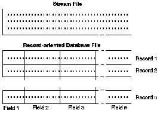

[Previous](2-1-2.md) | [Index](README.md) | [Next](2-1-2-2.md)

---

### 2\.1\.2\.1 Streams and Database Files

On the integrated file system, a stream is a continuous string of characters\. A database file is record\-oriented; it has predefined subdivisions consisting of one or more fields that have specific characteristics, such as length and data type\. [Figure 9](9.png) compares a stream file and a record\-oriented database file\.

*Figure 9\. Comparison of a Stream File and a Record\-Oriented Database File*

The default stream I/O for programs compiled with ILE C is simulated on top of an AS/400 database file\. This is simulated stream file processing with AS/400 records\. [Figure 10](10.png) shows how an AS/400 record is mapped to a C stream\.

*Figure 10\. AS/400 Records Mapping to a C Stream File*

The differences in the structure of stream files and record\-oriented database files affects how a program is written to interact with them and which type of file is best for a program\. A *record\-oriented file* can store customer information, such as name, address, and account balance\. These fields can be individually accessed and manipulated using the programming facilities of AS/400\. A *stream file* can store information such as a customer's picture, which is composed of a continuous string of bytes representing variations in color\. Stream files can also store strings of data such as the text of a document, images, audio, and video\.

---

[Previous](2-1-2.md) | [Index](README.md) | [Next](2-1-2-2.md)
