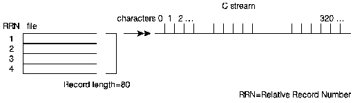

[Previous](2-2-3.md) | [Index](README.md) | [Next](2-2-3-2.md)

---

### 2\.2\.3\.1 Streams and Database Files

The C library presents a stream as a continuous string of characters\. If the file is a data management file, the records in the file are mapped to a stream as shown in [Figure 11](11.png)\.

*Figure 11\. AS/400 Data Management Records Mapping to a C Stream File*

---

[Previous](2-2-3.md) | [Index](README.md) | [Next](2-2-3-2.md)
