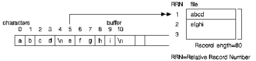
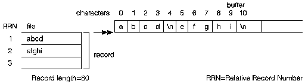

[Previous](2-2-4-3.md) | [Index](README.md) | [Next](2-2-4-5.md)

---

### 2\.2\.4\.4 Opening Text Stream Files

<a id="HDRWRKTXT"></a>

To open an AS/400 data management system file as a text stream file, use the `fopen()` function with a mode of `r`, `w`, `a`, `r+`, `w+`, or `a+` and the optional keyword parameters *lrecl*, *ccsid*, and *recfm* \(`F`, `FA`, and `FB` only\)\.

If the text stream file contains deleted records, the deleted records are skipped by the text stream I/O functions\.

#### **Reading and Writing to Text Stream Files**

If you are working with text stream files it is important to remember that a line corresponds to a record in an AS/400 database file\. Operations on text streams work with, at most, one record at a time\.

[Figure 12](12.png) shows that during a write operation to a text stream file, a new\-line character in the buffer causes the remainder of the record in the text stream file to be padded with blank characters \(hexadecimal value `0x40`\), and the record to be written to the text stream file\. The new\-line character itself is discarded\.

<a id="FIGFWTSF"></a>



*Figure 12\. Writing to a Text Stream File*

If the number of characters being written in the buffer exceeds the record length of the file, the data written to the file is truncated, and `errno` is set to `ETRUNC`\.

[Figure 13](13.png) shows that during a read operation from a text stream file, all the trailing blank characters \(hexadecimal value `0x40`\) in the record that is read from the file into a buffer are ignored, and a new\-line character is inserted after the last non\-blank\.

<a id="FIGFRTSF"></a>



*Figure 13\. Reading from a Text Stream File*

#### **Overwriting Existing Data with in a Stream File**

During an update operation to a text stream file, if the number of characters being written to the file exceeds the record length of the file, trailing characters in the record are truncated, and `errno` is set to `ETRUNC`\.

If the data being written to the text stream file is shorter than the record length being updated, and the last character of the data being written is a new\-line character, the record is updated and the remainder of the record is filled with blank characters\. If the last character of the data being written is not a new\-line character, the record is updated and the remainder of the record remains unchanged\.

#### **Opening, Reading, and Writing to a Text Stream File**

This program shows how to open, read, and write to a text stream file\. Library `MYLIB` must exist\. The file `TEST1` must exist\. The file `TEST2` is created for you if it does not exist\. The mode `"r"` indicates that the member `MBR` must exist in the file `TEST1`\. The mode `"w"` indicates that the member `MBR` in file `TEST2` is created if it does not already exist\. If the member `TEST2(MBR)` does exist, its contents are destroyed unless it is a logical file\.

```
     #include <stdio.h>
     #include <stdlib.h>

     #define  INFILE   "MYLIB/TEST1(MBR)"
     #define  OUTFILE  "MYLIB/TEST2(MBR)"
     #define  BUFSIZE  1024

     int main(void)
     {

          FILE *infp, *outfp;
          char buf [BUFSIZE]
          int line_num;

          /* Open an existing text file for reading.*/

          if (( infp = fopen ( INFILE, "r") ) == NULL )
            {
              printf ( "Cannot open %s\n", INFILE);
              exit (1);
            }

          /* Open an existing text stream file for writing.*/

          if (( outfp = fopen ( OUTFILE, "w") ) == NULL )
            {
              printf ( "Cannot open %s\n", OUTFILE);
              exit (2);
            }

          line_num = 0;

          /* While there are more lines to read.*/

          while (fgets (buf, sizeof(buf), infp) !=NULL)

            {
              fprintf(outfp, "%4d)  %s", line_num, buf);
            }

          /* Close the text files.*/

          fclose ( outfp );
          fclose ( infp );
          exit(0);
      }
```

---

[Previous](2-2-4-3.md) | [Index](README.md) | [Next](2-2-4-5.md)
