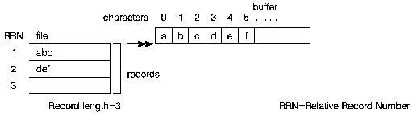
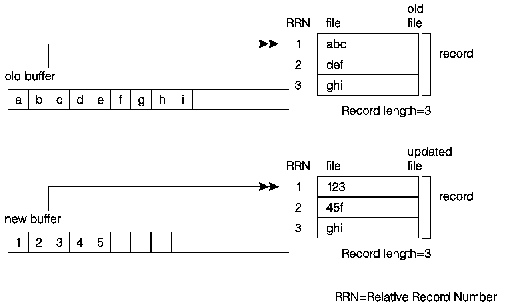
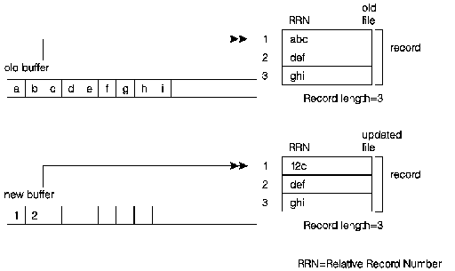

[Previous](2-2-4-4.md) | [Index](README.md) | [Next](2-2-4-6.md)

---

## 2.2.4.5 Opening Binary Stream Files (Character-At-a-Time Processing)

]

To open an AS/400 data management system file as a binary stream file for */ character-at-a-time processing, us`e the f`open() function with a mode of

keyword parameters blksize, lrecl, recfm, type, ccsid, and arrseq.

[FIGFWBSFC](14.png) `Fi`gu`re` 1`4` sh`ows` that `if` y`ou` write `da`ta to `a` binar`y s`tream that is processed one character at a time, and the size of the data is greater than the current record length, the excess data is written to the current record up to its record size, and the remaining data is written to the next record in the file.

#### [

Reading From and Writing to Binary Stream Files

<a id="FWBSFC"></a>


Figure 14. Writing to a Binary Stream File One Character at a Time

[Figure 15](15.png) shows that during a read operation from a binary stream that is processed one character at a time, if the length of the data being read is greater than the record length of the file, data is read from the next record in the file.

<a id="FRBSTC"></a>



Figure 15. Reading from a Binary Stream File One Character at a Time

#### 

Opening, Reading From, Writing to a Binary Stream File

This program shows how to open, read from, and write to a binary stream [ file one character at a time. The `file` TEST1 is created for you if it does ] not exist. The me`mbe`r MB`R in` TEST1 is created for you. The `mode` "wb+" indicates that a binary file is open for reading and writing, and that, if the member `MBR` exists, its contents are cleared. The file `TEST2` must << exist. The `mod`e "rb" indicates that a binary file is opened for reading.

```text
#include <stdio.h>
#include <stdlib.h>
int main(void)
{
FILE *fp1; [
ARE        char buf[5] = {'a', 'b', 'c', 'd', 'e'};[
/* Open an existing binary file for writing.*/:
if (( fp1 = fopen ( "MYLIB/TEST1(MBR)", "wb+" ) ) == NULL )
{
printf ( "Cannot open file\n" );
exit ( 1 );
}
printf ("Opened the file successfully\n");
/* Perform some I/O operations.*/
fprintf (fp1, "Hello, world");
]
/* Write 5 characters from the buffer to the file.*/
fwrite ( buf, 1, sizeof(buf), fp1 );
fclose ( fp1 );
FILE *fp2;
char buf2[6];(
/* Open an existing binary file for reading.      */ :
if (( fp2 = fopen ( "MYLIB/TEST1(MBR)", "rb" ) ) == NULL )
{
printf ( "Cannot open file\n" );
exit ( 1 );
}
]
/* Read characters from the file to the buffer.   */
fread ( buf2, 1, sizeof(buf2), fp2 );
[        printf ( "%.6s\n", buf2 );
fclose ( fp2 );
return (0);
}
```

Updating a Binary Stream File

[Figure 16](16.png) shows that if the amount of data being updated exceeds the current record length, the next record is updated with the excess data. If the current record is the last record in the file, a new record is created.

<a id="FUBSFCL"></a>



Figure 16. Updating a Binary Stream File With Data Longer Than the Record Length

[Figure 17](17.png) shows that if the amount of data being updated is shorter than the current record length, the record is partially updated and the remainder is unchanged.

<a id="FUBSFCS"></a>



Figure 17. Updating a Binary Stream File With Data Shorter Than the Record Length

Updating a Binary Stream File

This program shows updating a binary stream file `TEST1` with data that is longer than the record length, and updating a binary stream file `TEST2` with data that is shorter than the record length. `TEST1` is created for you if it does not exist. The file `TEST2` must exist. Assume that `TEST1` has a record length of less than six and `TEST2` has a record length greater than three.

```text
#include <stdio.h>
#include <stdlib.h>
int main(void)
{
FILE *fp1;
char buf[6] = {"12345"};[
/* Open an existing binary file for updating.*/[
and        if ((fp1 = fopen ("QTEMP/TEST1(MBR)", "rb+")) == NULL)
{
printf ("Cannot open file\n");
exit (1);
}]
/* Write 6 characters from the buffer to the file.*/
<        fwrite (buf, 1, sizeof(buf), fp1);
fclose (fp1);
FILE *fp2;
char buf2[3] = {"12"};[
/* Open an existing binary file for updating.*/(
an        if ((fp2 = fopen ("QTEMP/TEST2(MBR)", "rb+" )) == NULL)
{
printf ("Cannot open file\n");
exit (1);
}]
/* Write 3 characters from the buffer to the file.*/
<        fwrite (buf2, 1, sizeof(buf2), fp2);
fclose (fp2);
return (0);
}
```

---

[Previous](2-2-4-4.md) | [Index](README.md) | [Next](2-2-4-6.md)
