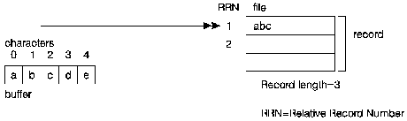
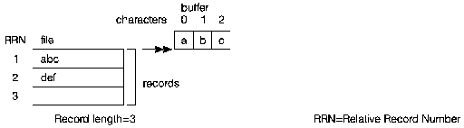

[Previous](2-2-4-5.md) | [Index](README.md) | [Next](2-2-5.md)

---

### 2\.2\.4\.6 Opening Binary Stream Files \(record\-at\-a\-time processing\)

To open an AS/400 data management system file as a binary stream file for record\-at\-a\-time processing, use the binary stream functions described in [Chapter 8, "Using AS/400 Database Files and DDM Files" in topic 3\.2](3-2.md) and [Chapter 9, "Using Device Files" in topic 3\.3](3-3.md)\.

Only the `fwrite()` function is valid for writing to binary stream files opened for record\-at\-a\-time processing\. All other output and positioning functions fail, and `errno` is set to `ERECIO`\.

Only the `fread()` function is valid for reading binary stream files opened for record\-at\-a\-time processing\. All other input and positioning functions fail, and `errno` is set to `ERECIO`\. See [Chapter 8, "Using AS/400 Database](3-2.md) [Files and DDM Files" in topic 3\.2](3-2.md) and [Chapter 9, "Using Device Files" in](3-3.md) [topic 3\.3](3-3.md) for examples of working with binary stream files one record at a time\.

#### **Reading From and Writing to Binary Stream Files**

[Figure 18](18.png) shows that if you write data to a binary stream processed one record at a time, and the product of *size* and *count* \(parameters of `fwrite()`\) is greater than the record length, only the data that fits in the current record is written, and `errno` is set to `ETRUNC`\.

If the product of *size* and *count* is less than the actual record length, the current record is padded with blank characters, and `errno` is set to `EPAD`\.

*Figure 18\. Writing to a Binary Stream File One Record at a Time*

If you read data from a binary stream processed one record at a time, and the product of *size* and *count* \(parameters of `fread()`\) is greater than the record length, only the data in the current record is read into the buffer\. The `fread()` function returns a value indicating that there is less data in the buffer than was specified\.

If the product of *size* and *count* is less than the actual record length, `errno` is set to `ETRUNC` to indicate that there is data in the record that was not copied into the buffer\.

[Figure 19](19.png) shows how only the current record is read into the buffer when the product of *size* and *count* is greater than the record length\.

*Figure 19\. Reading From a Binary Stream File One Record at a Time*

---

[Previous](2-2-4-5.md) | [Index](README.md) | [Next](2-2-5.md)
