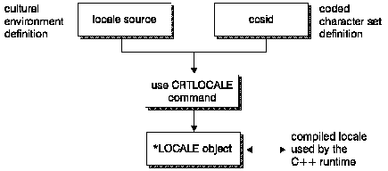

[Previous](3-5-3.md) | [Index](README.md) | [Next](3-5-5.md)

---

## 3.5.4 Creating Locales

On the AS/400 system, *LOCALE objects are created with the CRTLOCALE command, specifying the name of the file member containing the locale's definition source, and the CCSID to be used for mapping the characters of the locale's character set to their hexadecimal values.

A locale definition source member contains information about a language environment. This information is divided into a number of distinct categories which are described in ["Categories Used in a Locale" in](3-5-5.md) [[ topic](3-5-5.md) 3.5.5. One locale definition source member characterizes one language environment.

Characters are represented in a locale definition source member with their symbolic names. The mapping between the symbolic names, the characters they represent and their associated hexadecimal values is based on the CCSID value specified on the CRTLOCALE command.

[Figure 20](20.png) shows how a locale of type *LOCALE is created.

Figure 20. How a Locale of Type *LOCALE is Created

---

[Previous](3-5-3.md) | [Index](README.md) | [Next](3-5-5.md)
