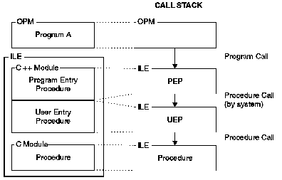
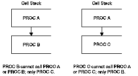

[Previous](4-1-1-2.md) | [Index](README.md) | [Next](4-1-2.md)

---

### 4\.1\.1\.3 Introducing the Call Stack

The *call stack* is a list of call stack entries, in a last\-in\-first\-out \(LIFO\) order\. A *call stack entry* is a call to a program or procedure\. There is one call stack per job\.

When an ILE program is called, the program entry procedure is first added to the call stack\. After the program entry procedure is called, control is given to the main entry point in the program \(`main()` for C or C\+\+\) which is pushed onto the stack\.

[Figure 21](21.png) shows a call stack for an program consisting of an OPM program which calls an ILE program consisting of two modules: a C\+\+ module containing the program entry procedure and the associated user entry procedure, and a C module containing a regular procedure\. The most recent entry is at the bottom of the stack\.

*Figure 21\. Program and Procedure Calls on the Call Stack*

> **Note:** In a program call, the calls to the program entry procedure and the user entry procedure \(UEP\) occur together, since the call to the UEP is automatic\. In later diagrams involving the call stack, the two steps of a program call are combined\.

An ILE C\+\+ procedure which is on the call stack can be called before it returns to its caller\. This is a *recursive* procedure call\. This is different from an ILE COBOL procedure which when on the call stack cannot be called until it returns to its caller\. This is a *non\-recursive* procedure call\. Therefore, be careful not to call from ILE C\+\+ procedures another ILE COBOL procedure which might call an already active ILE COBOL procedure\.

Assume that procedure `A` is an ILE C\+\+ procedure, procedure `B` and `C` are ILE COBOL procedures, and that these procedures are in the same program\. If procedure `A` calls procedure `B`, then procedure `B` can call neither procedure `A` nor `B`\. If procedure `B` returns and if procedure `A` then calls procedure `C`, procedure `C` can call procedure `B` but not procedure `A` or `C`\. See [Figure 22](22.png)\.

*Figure 22\. ILE C\+\+ Procedures Cannot Call Other Active ILE COBOL Procedures*

OPM COBOL programs already on the call stack cannot be called\.

---

[Previous](4-1-1-2.md) | [Index](README.md) | [Next](4-1-2.md)
