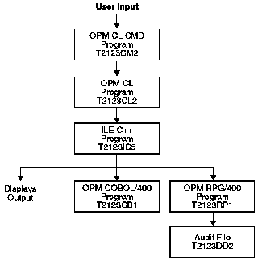

[Previous](4-1-8.md) | [Index](README.md) | [Next](4-1-8-2.md)

---

## 4.1.8.1 Program Description

The program is a small transaction-processing program that takes as input < the item name, price, and quantity for one or more products. As output, the program displays the total cost of the items specified on the display and writes an audit trail of the transactions to a file.

[Figure 23](23.png) shows the basic flow of the program.

Figure 23. Basic Program Structure

---

[Previous](4-1-8.md) | [Index](README.md) | [Next](4-1-8-2.md)
