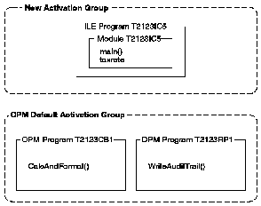

[Previous](4-1-8-2.md) | [Index](README.md) | [Next](4-1-8-4.md)

---

## 4.1.8.3 Program Activation

The ILE C++ program `T2123IC5` is created with the CRTPGM default for the ] ACTGRP parameter, ACTGRP(*NEW). When the CL program calls the ILE C++ program, a new activation group is started.

[ The OPM CL, COBOL, and RPG programs are activated within the OPM default activation group.

[Figure 24](24.png) shows the structure of this program in ILE.

Figure 24. Structure of the Program in ILE C++

---

[Previous](4-1-8-2.md) | [Index](README.md) | [Next](4-1-8-4.md)
