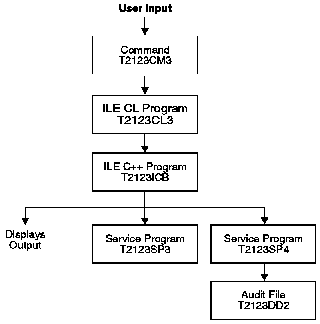

[Previous](4-1-9-1.md) | [Index](README.md) | [Next](4-1-9-3.md)

---

### 4\.1\.9\.2 Program Structure

The program consists of these components:

- A CL command `T2123CM3` that accepts the user input and passes it to an ILE CL program
- An ILE CL program `T2123CL3` that processes the input and passes it to an ILE program
- An ILE program `T2123ICB` in which the `main()` function of a C\+\+ module `T2123ICB` calls a procedure `CalcAndFormat` in an ILE COBOL module `T2123CB2`
- A service program `T2123SP3`, created from a C\+\+ source file `t2123icc.cpp`, that exports the variable `TAXRATE`
- A service program `T2123SP4`, created from an ILE RPG module object `T2123RP2`, that writes an audit trail of all transactions to a file
- An externally described file `T2123DD2` that receives the audit trail data

[Figure 25](25.png) shows the ILE structure\.

*Figure 25\. ILE Structure*

---

[Previous](4-1-9-1.md) | [Index](README.md) | [Next](4-1-9-3.md)
