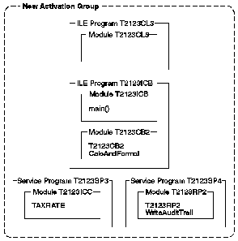

[Previous](4-1-9-2.md) | [Index](README.md) | [Next](4-1-9-4.md)

---

### 4\.1\.9\.3 Program Activation

The programs `T2123CL3` and `T2123ICB` are created with the CRTPGM default for the *ACTGRP* parameter, *ACTGRP\(\*NEW\)*\. When the CL program calls the ILE C\+\+ program, a new activation group is started\.

The service programs are created with the CRTSRVPGM default for the *ACTGRP* parameter, *ACTGRP\(\*CALLER\)*\. When they are called, they are activated within the activation group of the calling program\.

[Figure 26](26.png) shows the basic object structure used in this example\.

*Figure 26\. Basic Object Structure*

---

[Previous](4-1-9-2.md) | [Index](README.md) | [Next](4-1-9-4.md)
