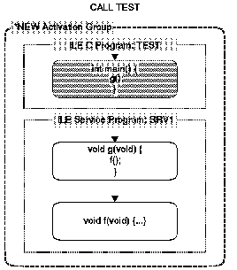
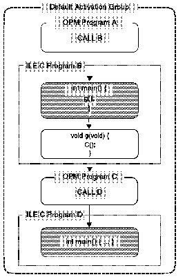
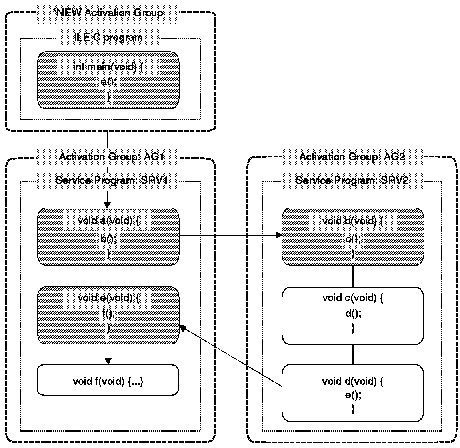

[Previous](4-3-3-5.md) | [Index](README.md) | [Next](4-3-5.md)

---

## 4.3.4 Understanding the Control Boundary in ILE

Use this legend for the next three figures:

**A**ctiva**tion** Group Dashed frame with rounded corners **Progra**m/Servi**ce** Program Dotted frame with square corners ****C**all**** s**tack entry Solid frame with rounded corners ****Control**** Boundary A shaded call stack entry

[Figure 27](27.png) shows how a control boundary is defined in a simple C++ program [ that runs in a si`ngle` *NEW activation group. This activation group is also called an AS/400 system named activation group. The program consists of a C++ program called `TEST`, which is bound by reference to a service program `<<`

The service program

was created with the ACTGRP(*CALLER)

option.

There is only one control boundary at procedure `main` in program `TEST`. This call stack entry is a control boundary since it is the first call stack entry in the activation group.

[ If an escape exception occurs in func`tio`n f() and no handlers are enabled, then the exception percolates from the call stack entry for `f()` to the ] call stack entry `fo`r g(), and then to the call stack entry `for m`ain(). Since `main()` is the control boundary, and the exception is unhandled, it << turns into a function check and is re-driven. The function check starts at call stack entry `f()` (where the exception occurred), and is percolated to the call stack entry for `g()`, and then to the call stack entry for `main()`. At this point, the function check has reached a control boundary and has not been handled. Therefore, a CEE9901 `*ESCAPE` message is sent to the caller of `main()`, and the activation group is terminated.

PICTURE 27

Figure 27. A Control Boundary When There is One Activation Group

[Figure 28](28.png) shows how control boundaries are set when calls are made between different activation groups. This program consists of one C++ program and < two service progr`ams` (SRV1 `and`

) that run in named activation groups

' (AG1 `an`d AG2). The funct`ions m`ai`n()`, `a()`, b(), `an`d e() are all potential control boundaries. When you are running in procedure `c()`, then `b()` would be the nearest control boundary.

The call stack entry for `main` is a control boundary since it is the first < call stack entry in the activation group. The call stack entries `fo`r a(), `++` b()`, a`nd e() are control boundaries, since the immediately preceding call stack entry for each runs in a different activation group.

[ If an escape exception occurs in func`tio`n d() and no handlers are enabled, then the exception percolates from the call stack entry for `d()` to the call stack entry for c(), and then to the call stack entry for b(). Since [ the call stack e`ntr`y b() is a control boundary, the exception is turned [ into a function check and is re-driven. The function check starts at ] func`tio`n d(), and is percolated to the call stack entry `fo`r c(), and then to the call stack entry for `b()`. At this point, the function check has reached a control boundary and has not been handled. A CEE9901 `*ESCAPE` message is sent to the call stack entry for function `a()`, and the activation group `AG2` is terminated.

If `exit()` was called from within function `a()`, then it cancels up the call & stack entry `fo`r a(), control returns to the call stack entry `for m`ain(), and the activation group `AG1` is terminated. At this time, `atexit()` routines for activation group `AG1` are called, if any exist.

] `If e`xit() was called from within func`tio`n f(), then it cancels the call stack entries until it reaches the control boundary at the call stack /* entr`y f`or e() (for example, the call stack entries for `bo`th e(`) a`nd f() are canceled). Since this control boundary is not the first one in activation group `AG1`, the activation group is not taken down, and control returns to the call stack entry for function `d()`. ***/** `Note: I`f an atexit() is registered `by` function f(), it is not called, since the activation group is not terminated.

Figure 28. Control Boundaries When There are Multiple Activation Groups

[Figure 29](29.png) shows how control boundaries are set for a program that is running in the default activation group. The program consists of two OPM & progr`a`ms, A and C, and two ILE C++ progr`a`ms, B and D, which were created ] using the ACTGRP(*CALLER) option on the AS/400 CRTPGM command. In this program, the function `main()` in program `B` and the function `main()` in program `D` are potential control boundaries.

The call stack entries for `main()` in programs `B` and `D` are control boundaries since the immediately preceding call stack entry for each is that of an OPM program.

[ If an escape exception occurs in func`tio`n g() in pro`g`ram B and no handlers are enabled, then the exception percolates from the call stack entry for `&` g() to the call stack entry `for m`ain(). Since the call stack entry for `main()` is a control boundary, the exception is turned into a function ] check and is re-driven. The function check starts at func`tio`n g(), and is [ percolated to the call stack entry `for m`ain(). At this point, the function check has reached a control boundary and has not been handled. The call stack entries for `g()` and `main()` are canceled, and a CEE9901 escape message is sent to the call stack entry for program A.

**Note:** The activation group is not taken down, since the default activation group only goes away at job termination time.

Figure 29. Control Boundaries in the Default Activation Group

---

[Previous](4-3-3-5.md) | [Index](README.md) | [Next](4-3-5.md)
