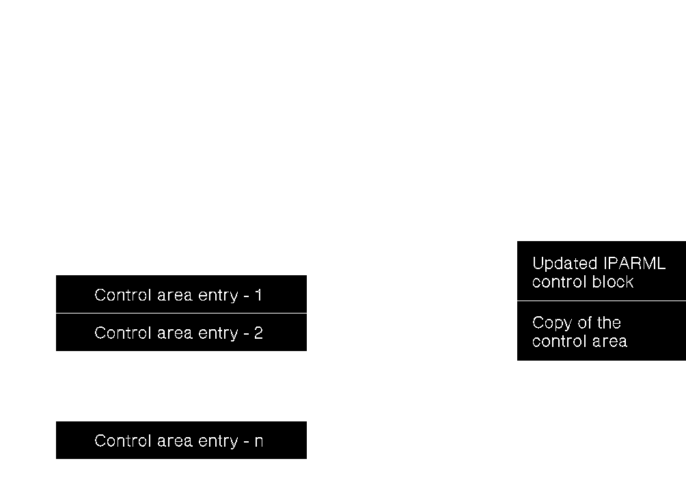
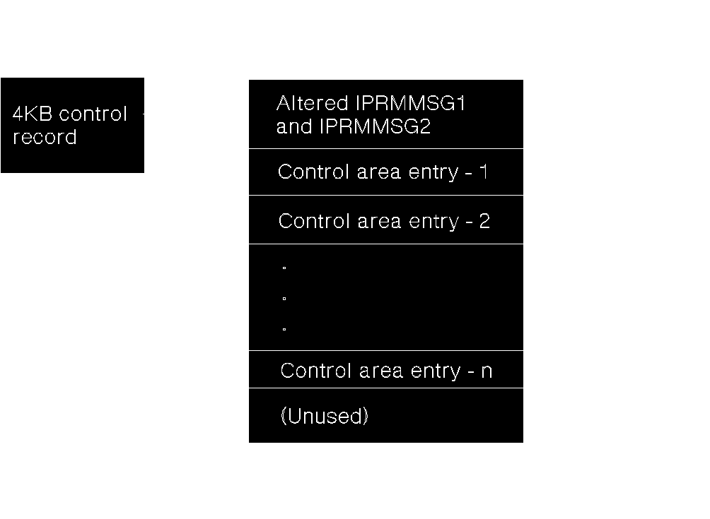

[Previous](c-1-2.md) | [Index](README.md) | [Next](c-1-4.md)

---

#### C.1.3 Putting *MONITOR Data Into the MONWRITE Control Record

[Figure 80](1.png) illustrates how the MONWRITE program puts the data presented by the *MONITOR CP system service into the MONWRITE control record. The *MONITOR CP system service sends the control area delimiters by means of the external interrupt buffer that results from the IUCV SEND command. The control area and the pages with the monitor data reside in the monitor saved segment.

Figure 80. Putting *MONITOR Data into the MONWRITE Control Record

[Figure 81](2.png) illustrates the details of the control records. The control record includes: An updated version of the message pending external interrupt buffer, received as a result of an IUCV SEND. This area, mapped by the IPARML control block, contains: IPRMMSG1--the displacement to the first byte of the control area. IPRMMSG1 is a fullword containing the offset from the start of this 4KB control record to the start of the control area. IPRMMSG2--the displacement to the last byte of the control area. IPRMMSG2 is a fullword containing the offset from the start of this 4KB control record to the last byte of the control area. All other fields from the external interrupt buffer, which are copied unchanged.

Figure 81. Details of the Control Record within the Output File

---

[Previous](c-1-2.md) | [Index](README.md) | [Next](c-1-4.md)
