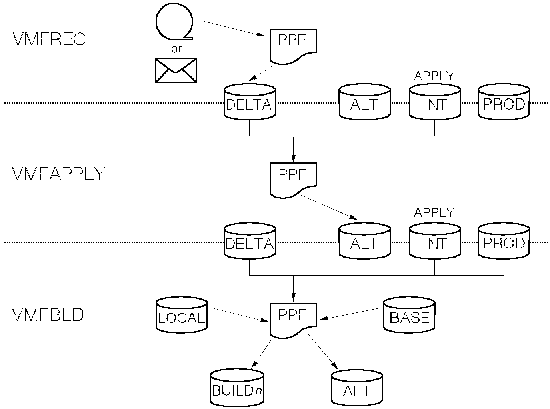

[Previous](1-1.md) | [Index](README.md) | [Next](1-2-1.md)

---

## 1.2 Overview of the Service Procedure

You install service to VM/ESA one component at a time, in the following order:

**VMSES/E** Virtual Machine Serviceability Enhancements Staged/ Extended **REXX/VM** REXX/VM **CMS** Conversational Monitor System **CP** Control Program **GCS** Group Control System **Dump** **Viewing** **Facility** Dump Viewing Facility **TSAF** Transparent Services Access Facility **AVS** APPC/VM VTAM Support When you service a VM/ESA component, you execute a series of commands to accomplish the four main service tasks: Merging service Receiving service for the component Applying service to the component Reapplying local service (if applicable) Rebuilding the component Placing your serviced components into production. The software inventories are updated when receiving, applying and building service. Files are transferred and stored on several disks during service | installation. These apply disks are called the alternate, intermediate, and production disks. They are used as follows: The alte**rnate dis**k is used as a work disk, or staging area, during the installation of new service The inte**rmediate dis**k contains the last level of service that was installed The prod**uction dis**k contains all of the previous levels of service that were installed. You will see how these disks are used in greater detail in the following sections. [Figure 1-1](1.png) shows the flow of information from disk to disk when you install service for a component.

<a id="INTDISK"></a>



Figure 1-1. Disks Used When Installing Service

```text
    ________________________________________________________________________ 
```

Subtopics:

- [1.2.1 Merging Service](1-2-1.md)
- [1.2.2 Receiving Service](1-2-2.md)
- [1.2.3 Applying Service](1-2-3.md)
- [1.2.4 Reapplying Local Service (If Applicable)](1-2-4.md)
- [1.2.5 Building New Levels](1-2-5.md)
- [1.2.6 Placing the Serviced Components into Production](1-2-6.md)

---

[Previous](1-1.md) | [Index](README.md) | [Next](1-2-1.md)
