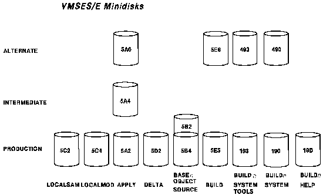
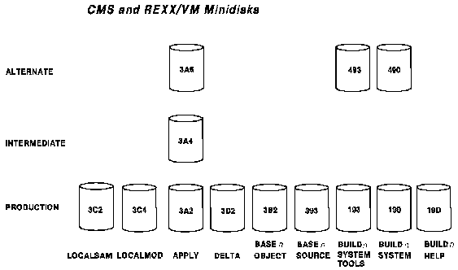
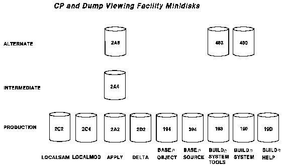
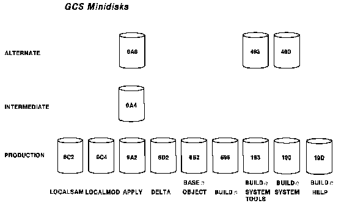
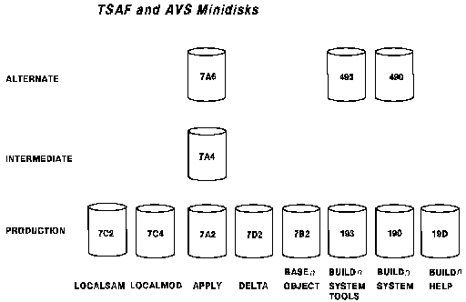

[Previous](1-4.md) | [Index](README.md) | [Next](1-5-1.md)

---

## 1\.5 Disks Used to Service VM/ESA

The following sections describe how the service disks are used during the installation of service\.

Each component uses a set of disks to control the installation of service and local modifications\. CP and the Dump Viewing Facility share the same set of disks\. CMS and REXX/VM share the same set of disks\. AVS and TSAF share the same set of disks \(though they have unique SFS directories\)\. VMSES/E and GCS each have a unique set of disks or SFS directories\.

A number of service disks are defined and used as follows: **TASK** The task disks contain any files that you want accessed before the service disks defined for a component\. No default task disks are defined in VM/ESA Release 2\. **LOCALMOD** The local disk \(*n*C4\) contains any local modifications you have installed, except PTF fixes\. **LOCALSAM** The local sample disk \(*n*C2\) contains the sample and example files you receive from IBM, for example, SYSTEM CONFIG, LOGO CONFIG, HCPRIO, HCPSYS, and DMSNGP\. **DELTA** The delta disk contains all files received from a service tape, plus the software inventory files generated by the VMFREC command\. Files on this disk include PTF\-numbered parts, updates, and PTF information \(such as PTFs received, requisites to those PTFs, and APAR descriptions\)\. There is one default disk defined as a delta disk for each component in VM/ESA\. **Delta disk \(***n***D2\)** This disk contains all files loaded by the VMFREC command, all of the PTFs that have been previously received for a component, and the software inventory files generated by VMFREC\. **APPLY** The apply disks identify the service level of a component, and the service level of each part\. These disks contain all files generated by the VMFAPPLY and VMFBLD commands\. This includes software inventory files and AUX files\. There are three default disks defined as apply disks for each component in VM/ESA: the alternate apply disk, the intermediate apply disk, and the production apply disk\. **Alternate Apply disk \(***n***A6\)** This disk is used as a staging disk for VMFAPPLY and VMFBLD processing\. This disk is only used as a staging disk to allow for recovery if VMFAPPLY or VMFBLD fails\. **Intermediate Apply disk \(***n***A4\)** This disk contains the level of service that was last installed\. The purpose of the intermediate disk is to separate service levels so that you can easily back out the level of service on the alternate disk\. This disk is also used as the test level of the system\. **Production Apply disk \(***n***A2\)** This disk contains the level of service that has been placed into production\. When a component is placed into production all files that reside on the intermediate apply disk are moved to the production apply disk \(using VMFMRDSK\)\. **BUILD***n* The build disks contain all the usable forms \(objects\) built by VMFBLD\. **BASE***n* The base disks contain the object code and base source code for a component\. The base disks are never updated during the service process\. **SYSTEM** The system disks are disks you want accessed after the service disks defined for a component\.

The following charts represent the disks used to service the components of VM/ESA\. Note that some of the components share the same disks for service, such as CP and the Dump Viewing Facility\.

*Figure 1\-3\. Disks Used When Servicing VMSES/E*

*Figure 1\-4\. Disks Used When Servicing CMS and REXX/VM*

*Figure 1\-5\. Disks Used When Servicing CP and Dump Viewing Facility*

*Figure 1\-6\. Disks Used When Servicing GCS*

*Figure 1\-7\. Disks Used When Servicing TSAF and AVS*

Subtopics:

- [1\.5\.1 Building New Objects](1-5-1.md)

---

[Previous](1-4.md) | [Index](README.md) | [Next](1-5-1.md)
