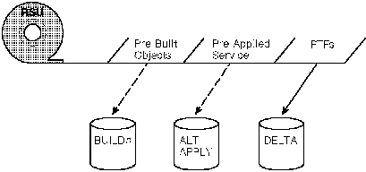
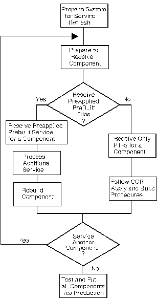

[Previous](1-6-1.md) | [Index](README.md) | [Next](2-1.md)

---

# 2\.0 Chapter 2\. Using the Product Service Upgrade \(PSU\) Procedure

You can upgrade your existing VM/ESA Release 2 system using the service files from the IBM VM/ESA Recommended Service Upgrade Tape\. **This is the method of installing preventive service to VM/ESA** that was introduced in VM/ESA Release 1\.1\. The procedure for performing a Product Service Upgrade from the VM/ESA RSU Tape is outlined in this chapter\.

**Note:** This procedure is not intended for use by customers migrating from a previous release of VM\. It should only be used to upgrade from a previous service level of VM/ESA Release 2\.

The RSU Tape that is processed using the PSU procedure has the following logical structure for each component\.

*Figure 2\-1\. RSU Tape and Files*

The RSU Tape is structured to allow you to use one of two methods to install the service\.

- The first method is to install all PTFs included on the tape plus the tape files containing the preapplied service and prebuilt objects\. All PTF\-related files are loaded to the delta disk\. The tape file containing the preapplied service, i\.e\. containing the results of VMFAPPLY, is loaded to the alternate apply disk and the contents of the tape files containing prebuilt objects are loaded to the appropriate build disks\.

This method saves considerable time if you have only a small number of local modifications and/or PTFs already installed that are not contained on the RSU Tape\.

- The second method is to install all of the PTFs included on the tape and bypass the tape files containing the preapplied service and prebuilt objects\. All PTF\-related files are loaded to the delta disk\. The tape file containing the preapplied service, i\.e\. containing the results of VMFAPPLY, is bypassed and the contents of the tape files containing prebuilt objects are also bypassed\. This results in having all PTFs received the same as if they were shipped on a COR tape\. You must apply the PTFs received using VMFAPPLY and build all serviced objects using VMFBLD\.

This method avoids reapplying any PTFs that you have already installed, that are not included on the RSU Tape\. It also avoids altering any objects that you have already built on the test build disks\.

Points to consider about using the Product Service Upgrade procedure are:

- This process will not alter any of your tailored files in any way
- It only pertains to the VM/ESA licensed program\.
- Planning must be done \(such as determining disk sizes, and determining what service, if any, on your existing system is not contained on the RSU Tape\) prior to actually loading the service from the RSU Tape\. These tasks will be discussed\.
- CMS, CP and GCS nuclei, as well as saved segments need to be rebuilt to pick up the new service\.

*Figure 2\-2\. Service Application Flowchart using PSU*

The following outline is an overview of what tasks need to be performed during the PSU procedure\.

1\. Prepare System

["Prepare Your System for Service Refresh" in topic 2\.2](2-2.md) helps you to prepare your system to receive the service from the RSU Tape\.

In this task you will receive the documentation contained on the RSU Tape and determine the DASD required to install the RSU Tape\.

The following step should be performed for each component in VM/ESA, using the order of application of service described in [Chapter 1,](1-0.md) ["Servicing Your System\."](1-0.md)

2\. Prepare to Receive a Component

In the task, ["Prepare to Receive a Component from the RSU Tape" in](2-3.md) [topic 2\.3](2-3.md), you will determine the number of PTFs that will need to be reapplied and decide the best way to receive the service contained on the RSU Tape\. If you have a large number of PTFs to re\-apply you should follow the procedure to receive only the PTFs from the RSU Tape\. Otherwise, you should follow the procedure to receive preapplied prebuilt service\.

- Process Preapplied, Prebuilt Service

a\. Receive Preapplied, Prebuilt Service

["Receive the Preapplied, Prebuilt Service" in topic 2\.3\.1](2-3-1.md) contains the receive process for the RSU Tape\.

b\. Process Additional Service for a Component

["Process Additional Service" in topic 2\.3\.2](2-3-2.md) will help you reapply any additional service\.

c\. Rebuild Component

Finally, ["Build the New Service Level" in topic 2\.3\.3](2-3-3.md) identifies the build sections required for each component\. After completing build steps for the component, you should continue with the next component to be processed\.

- Process Only PTFs from the RSU Tape

a\. Receive Only PTFs from RSU Tape

["Receiving Only PTFs from an RSU Tape" in topic 2\.4\.1](2-4-1.md) shows you how to receive only the PTFs contained on the RSU Tape\. This procedure installs the service as if it was corrective service\.

b\. Follow COR Apply and Build Procedures

After you have received the PTFs, you need to apply the service and rebuild the component using the COR procedures defined for the component in [Chapter 3, "Using the COR Service](3-0.md) [Procedure\."](3-0.md)

3\. Service Another Component?

If you have another component to service, repeat the steps in this outline, beginning with step 3\.

4\. Test and Put All Components into Production

In this step you will place the new service into production\. This is the last step in the PSU Procedure\.

Subtopics:

- [2\.1 Materials Needed for a Product Service Upgrade](2-1.md)
- [2\.2 Prepare Your System for Service Refresh](2-2.md)
- [2\.3 Prepare to Receive a Component from the RSU Tape](2-3.md)
- [2\.4 Alternate Receive Procedure for a Component](2-4.md)

---

[Previous](1-6-1.md) | [Index](README.md) | [Next](2-1.md)
