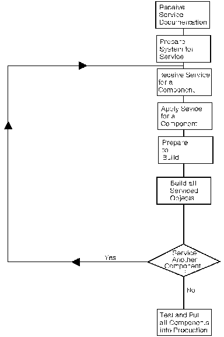

[Previous](3-0.md) | [Index](README.md) | [Next](3-2.md)

---

## 3.1 How to Install COR Service

You install COR service by component. There is a step in the service procedure for each component and each contains the specific commands and operands for the component. To install COR service to VM/ESA, you must: 1. Receive the service documentation. 2. Prepare the system for service. 3. Service the VM/ESA components. 4. Place the newly-serviced components into production.

<a id="FLWCHRT"></a>



Figure 3-1. Service Application Flowchart

```text
    ________________________________________________________________________ 
```

To service each component, you must: 1. Receive the service for the component. a. Read the Memo-to-Users for the component. b. Use the VMFREC command to receive the service. c. Review the receive message log and correct any errors. 2. Apply the service to the component parts. a. Verify that the component's alternate apply disk is ready to apply service for the component and determine whether merge processing is required. b. Use the VMFAPPLY command to apply the service. c. Review the apply message log and correct any errors. 3. Rebuild the component. a. Perform any tasks that are required to rebuild the component. b. Review the build message log and correct any messages. c. Test the new level of the component and correct any errors. To put serviced components into production: 1. Build segments. 2. Merge the intermediate apply disk, with the tested service, to the production disk. The receive and apply steps are similar for each component. The build step, however, varies from component to component. Building a component may involve rebuilding a nucleus, load libraries, or executable modules. Or it may only require placing updated objects (such as EXECs and HELP files) into production. For each component, you must decide whether to build each serviced object individually, or to build all objects at once. Once all of the components are built, you must test the components and place them into production. The order in which you service the VM/ESA components is important, because some components have dependencies on others and all of the procedures require the VMSES/E component to be at the latest level. For example, REXX/VM is serviced before CMS because it is needed to build the CMS and/or GCS nucleus correctly. Complete the installation of service for each component before you proceed to the next. The VM/ESA components should be serviced in the following order: 1. VMSES/E 2. REXX/VM 3. CMS 4. CP 5. GCS 6. Dump Viewing Facility 7. TSAF 8. AVS.

---

[Previous](3-0.md) | [Index](README.md) | [Next](3-2.md)
