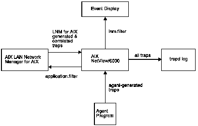

[Previous](3-1.md) | [Index](README.md) | [Next](3-3.md)

---

## 3\.2 Understanding Traps

LNM for AIX obtains information about the LAN environments that it is managing by communicating with agents that reside in those environments\. The agents send traps to LNM for AIX, both in response to commands from the program and as unsolicited notifications of network changes\. LNM for AIX then processes these traps to enable proper correlation between the resource to which the trap pertains and the topological display of that resource\.

All traps that are sent from the LAN environments are received first by AIX NetView/6000\. When LNM for AIX is installed, it registers with AIX NetView/6000 to receive traps from specific types of agents in the network\. The individual agents are collectively identified by an enterprise identifier, which is a dotted decimal representation of the enterprise\-specific MIB that the different types of agents use\. LNM for AIX subscribes to traps that are broadcast from agents with a particular enterprise ID, and in doing so LNM for AIX receives traps from all agents that share the ID\.

As part of LNM for AIX configuration, you specify which agents will be communicating with LNM for AIX\. When LNM for AIX starts, the discovery process begins for the LNM for AIX agent programs that you have configured in SMIT\. As agents respond to the discovery process, AIX NetView/6000 begins to receive traps from the newly identified agents and then forward them to LNM for AIX\. The traps received from agents do not contain enough information to enable AIX NetView/6000 to correlate its topology display with the AIX NetView/6000 event display, and the AIX NetView/6000 event history\. To ensure that this correlation information is provided to AIX NetView/6000, LNM for AIX processes the traps that AIX NetView/6000 has forwarded\. In doing so, LNM for AIX creates a new trap that combines the original information with the name of the affected resource\.

When LNM for AIX completes its trap processing, the trap is sent to AIX NetView/6000, where it is recorded in the trapd log\. The trap is also recorded in the event card display, if the LNM for AIX filter is active and if the trap's format allows it\. For more information on the LNM for AIX filter, read ["Using Filters" in topic 3\.3](3-3.md)\.

**Note:** The first instance of a trap in the trapd log does not contain correlation information, so the information in the trap may contain unformatted hexadecimal data\. When you view the trapd log for entries pertaining to LNM for AIX, look for the second instance of each trap\.

[Figure 1](1.png) depicts the flow of traps from an agent, through AIX NetView/6000 to LNM for AIX, and back again\.

*Figure 1\. Trap Flow and Correlation from Agent to AIX NetView/6000*

When LNM for AIX is installed, the **addtrap** command is invoked to generate customized trap definitions for the /usr/OV/conf/trapd\.conf file\. These definitions provide a more meaningful display of LNM for AIX traps when they are logged by the AIX NetView/6000 trapd log\. You can modify these trap definitions to tailor the information that appears in the event display to your own needs\. For more information about how to customize the trap formats, refer to the *AIX SystemView NetView/6000 User's Guide*\.

---

[Previous](3-1.md) | [Index](README.md) | [Next](3-3.md)
