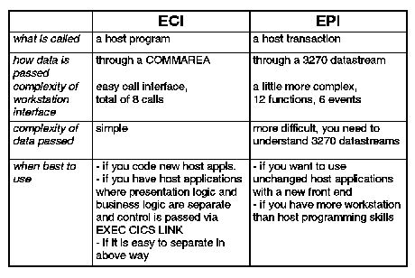

[Previous](1-3-1.md) | [Index](README.md) | [Next](1-3-3.md)

---

### 1\.3\.2 The External Interfaces

Non\-CICS based workstation applications can access server facilities using the external CICS interfaces\. With these APIs you can write, for example, workstation applications which, on the workstation side, make use of typical modern graphical user interfaces \(GUIs\) and at the same time have access to server data and programs on the host\.

Workstation applications can, through CICS clients, communicate with a server by three mechanisms:

- The External Call Interface \(ECI\), which enables the design of new applications to be optimized for client/server operation, with the business logic on the server and the presentation logic on the client\.
- the External Presentation Interface \(EPI\), which enables modern technologies, such as graphical or multimedia interfaces, to be used with traditional 3270 CICS applications\.
- 3270 terminal and printer emulation\. This provides CICS 3270 emulation for CICS servers to which the client is connected\.

The following table should help you to choose between ECI and EPI\.

*Figure 1\. Comparing ECI and EPI\.*

Subtopics:

- [1\.3\.2\.1 The External Call Interface](<#1.3.2.1>)
- [1\.3\.2\.2 External Presentation Interface](<#1.3.2.2>)
- [1\.3\.2\.3 Terminal Emulation](<#1.3.2.3>)

---

[Previous](1-3-1.md) | [Index](README.md) | [Next](1-3-3.md)
