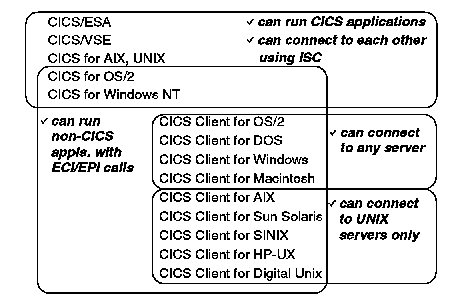

[Previous](1-3-2.md) | [Index](README.md) | [Next](2-0.md)

---

### 1\.3\.3 CICS Communication Protocols

The CICS clients can communicate with the following CICS server products:

- CICS for Windows NT Version 2
- CICS on Unix based systems, that is:

CICS for AIX CICS for HP 9000 CICS for Digital UNIX\.

- CICS/400 Version 3 Release 1, and higher
- CICS for MVS/ESA Version 3 Release 3, and higher
- CICS/MVS Version 2 Release 1\.2
- CICS/VSE Version 2 Release 2 and higher\.

The CICS clients can communicate using the following protocols:

- Network Basic Input/Output System \(NetBIOS\)
- Transmission Control Protocol/Internet Protocol \(TCP/IP\)
- Advanced Program\-to\-Program Communication \(APPC\)\.

CICS clients communicate with mainframe CICS application servers such as CICS/VSE using APPC, usually through a local area network \(LAN\) and Systems Network Architecture \(SNA\) gateway\. In an IBM LAN, gateway communication facilities are provided by an SNA product running on the gateway machine, for example, IBM Communications Server/2 \(CS/2\)\.

**Note:** CICS clients on Unix based systems can only connect to CICS servers on Unix based systems\. Of course these servers can, in turn, connect to any other CICS server using ISC\.

The following figure summarizes CICS client/server facilities\.

*Figure 4\. Summary: CICS Client and Server Functions\.*

---

[Previous](1-3-2.md) | [Index](README.md) | [Next](2-0.md)
