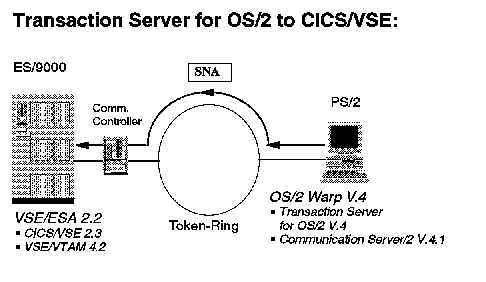
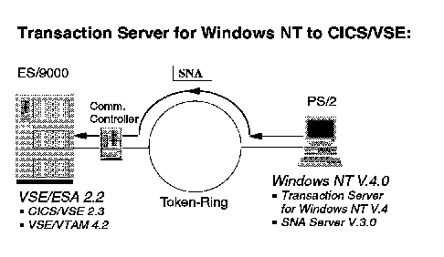

[Previous](2-1.md) | [Index](README.md) | [Next](2-1-2.md)

---

### 2\.1\.1 Connecting Transaction Servers and CICS/VSE

When you run a Transaction Server on an OS/2 or Windows NT system, you have a full function CICS system available on that platform\. Connecting to CICS/VSE allows you to use:

- all the ISC functionality you get when you connect two CICS systems\. You can for example:

run the CRTE transaction in a workstation window which contains a workstation CICS terminal\. When you specify the SYSID of the CICS/VSE server as a CRTE parameter your workstation CICS terminal now acts as a CICS/VSE terminal\. define CICS/VSE transactions as remote transactions to your workstation CICS and run them from a workstation window which contains a workstation CICS terminal\. define CICS/VSE files as remote files to your workstation CICS and use them in workstation CICS transactions\. link to CICS/VSE programs and so on\.

For details see ["InterProduct Communication" in topic 1\.3\.1](1-3-1.md)\.

- support access of CICS clients to CICS/VSE through the Transaction Server\.
- run non\-CICS applications on your workstation which make use of CICS/VSE resources through the ECI or EPI\. Details about ECI and EPI can be found in ["The External Interfaces" in topic 1\.3\.2](1-3-2.md)\.

The following figure shows a direct connection between the Transaction Server for OS/2 and CICS/VSE\. Details for this configuration can be found in ["The Transaction Server for OS/2 Warp" in topic 4\.1](4-1.md)\.

*Figure 5\. Transaction Server for OS/2 to CICS/VSE\.*

To establish the SNA connection you can use Communications Server/2 on your workstation and VTAM on VSE/ESA\.

In all our examples the connection is made over a Token\-Ring and we used a 3172 Communication Control Unit\.

The next figure shows the same situation for a Windows NT system\. It depicts a direct connection between the Transaction Server for Windows NT and CICS/VSE\. Details are described in ["The Transaction Server for Windows](4-2.md) [NT" in topic 4\.2](4-2.md)\.

*Figure 6\. Transaction Server for Windows NT to CICS/VSE\.*

To establish the SNA connection we used the Microsoft SNA Server on the workstation and, of course, again VTAM on VSE/ESA\.

---

[Previous](2-1.md) | [Index](README.md) | [Next](2-1-2.md)
