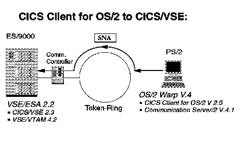
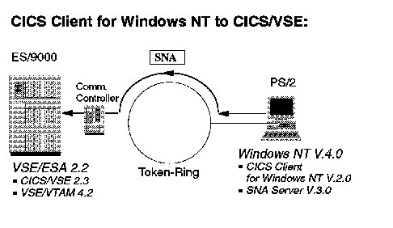
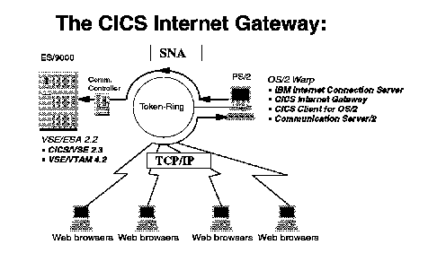
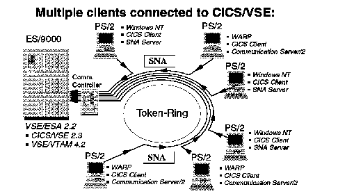

[Previous](2-1-1.md) | [Index](README.md) | [Next](2-2.md)

---

### 2\.1\.2 Connecting CICS Clients and CICS/VSE

You can connect CICS clients directly to VSE/ESA\. In this case you do not have a full function CICS on your workstation\. You cannot, for example run CICS applications on the workstation\.

You also cannot communicate with CICS/VSE using ISC functions\. But you can use terminal emulation for CICS/VSE, that is, you can use CICS/VSE transactions from a CICS client terminal\.

You can also run non\-CICS applications on your workstation which make use of CICS/VSE resources through the ECI or EPI\. Details about ECI and EPI can be found in ["The External Interfaces" in topic 1\.3\.2](1-3-2.md)\.

There are also solutions such as

- the CICS Internet gateway
- links to Lotus Notes

which are based on the ECI or the EPI\. These solutions have a CICS client as a prerequisite\. To use them in connection with CICS/VSE you have to connect the workstation with a CICS client to VSE/ESA\.

The next figure shows you what is required to connect a CICS Client for OS/2 to CICS/VSE\.

*Figure 7\. CICS Client for OS/2 to CICS/VSE\.*

As in the OS/2 Transaction Server case, connection is established between Communication Server/2 and VTAM for VSE\. Details are described in ["Connecting Directly to CICS/VSE" in topic 5\.2\.1](5-2-1.md)\.

The setup for Windows based systems looks very similar:

*Figure 8\. CICS Client for Windows NT to CICS/VSE\.*

The main difference to the OS/2 Transaction Server case is that the SNA Server for Windows NT is used to set up communication with VTAM\. Details can be found in ["Connecting Directly to CICS/VSE" in topic 5\.3\.1](5-3-1.md)\.

There is a CICS Client for Windows 95, but no full SNA Server which is required to set up an APPC connection to VSE/ESA\. Therefore, you cannot set up a direct connection between a CICS Client for Windows 95 and CICS/VSE\.

Normally you would not have only one CICS client connected to your CICS/VSE, but many\. An exception could be the case where you use one of the predefined solutions for CICS/VSE access mentioned above\. For example, a configuration for the CICS Internet Gateway could look like this:

*Figure 9\. CICS Client used with the CICS Internet Gateway\.*

If you have multiple CICS clients you can of course connect a mix of several OS/2 and Windows NT clients to CICS/VSE, all of them with direct connections, as shown in the following figure:

*Figure 10\. A Mix of Multiple CICS Clients\.*

As you can see you have lots of individual SNA connections to VSE/ESA\. Therefore, in such a case it may, however, be more economic to bundle the connections to VSE/ESA through intermediate servers\. This is discussed in the next section\.

---

[Previous](2-1-1.md) | [Index](README.md) | [Next](2-2.md)
