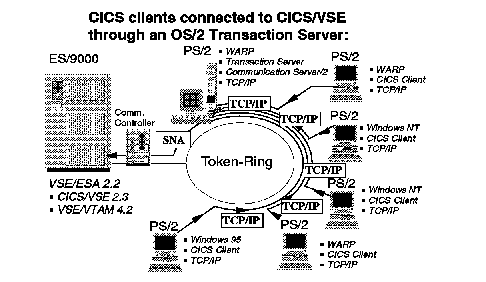
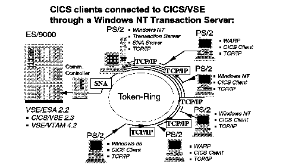

[Previous](2-1-2.md) | [Index](README.md) | [Next](2-3.md)

---

## 2\.2 Connections of CICS Clients through Transaction Servers

In a situation where you have a Transaction Server on one of your workstations and multiple CICS clients on other workstations it may be a better idea to connect the clients to the Transaction Server and the Transaction Server to CICS/VSE rather than connecting all the clients directly\.

In the later case you would have to maintain an SNA connection from each workstation to VSE/ESA\. This means additional definitions in VTAM and CICS/VSE and thus additional maintenance effort\.

It also means that you have to install, set up and maintain an SNA capable software product on each client workstation\.

Compare this to the situation for OS/2 where you would have Communications Server/2 installed only on the system, where Transaction Server for OS/2 is installed\. Communication between CICS clients and Transaction Server can then be through TCP/IP, for example\.

*Figure 11\. CICS Clients Connected through OS/2 Transaction Server\.*

Note that not only OS/2 clients can connect through the OS/2 Transaction Server\. There can be a mix of OS/2 and Windows CICS clients\. The Windows CICS clients can run on Windows NT or on Windows 95\.

It is also worth mentioning that now client terminals connect to the Transaction Server\. You can run CICS/VSE transactions from a client terminal, but only if these are defined in the Transaction Server as remote transactions \(or if CICS/VSE is set up as default remote system\)\.

The CICS ECI and EPI interface are now supported through the Transaction Server\. In other words when a non\-CICS program on a client issues an EPI call or an ECI call, access to a CICS transaction or program is requested from the Transaction Server\. If the CICS resource is, in fact, a resource owned by CICS/VSE then the requested is routed from the Transaction Server to CICS/VSE through ISC\.

Details of this setup can be found in ["Connecting to Transaction Server](5-2-2.md) [for OS/2 Warp" in topic 5\.2\.2](5-2-2.md) and ["Connecting to Transaction Server for](5-2-3.md) [Windows/NT" in topic 5\.2\.3](5-2-3.md)\.

The situation for a Transaction Server for Windows NT is nearly identical, as the following figure shows\.

*Figure 12\. CICS Clients Connected through Windows NT Transaction Server\.*

Note that again, a mix of CICS clients can connect through the Transaction Server for Windows NT\.

It should be obvious that you can connect several Transaction Servers and that you can mix OS/2 and Windows based systems if this should be required\.

Details of this setup can be found in ["Connecting to Transaction Server](5-2-2.md) [for OS/2 Warp" in topic 5\.2\.2](5-2-2.md) and ["Connecting to Transaction Server for](5-3-3.md) [Windows/NT" in topic 5\.3\.3](5-3-3.md)\.

For OS/2 you need a Communications Server/2 on each client or server workstation which you want to connect to VSE/ESA\. Each Communications Server/2 will then establish its own, individual SNA session to VTAM on VSE/ESA\.

For the SNA Server of Windows you have an additional option which is introduced below\.

---

[Previous](2-1-2.md) | [Index](README.md) | [Next](2-3.md)
