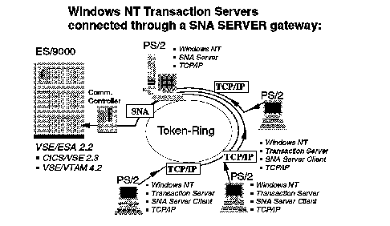
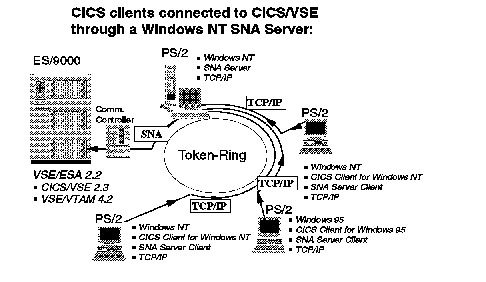

[Previous](2-2.md) | [Index](README.md) | [Next](2-4.md)

---

## 2\.3 Connections of SNA Clients through the SNA Server

The Microsoft SNA Server can establish direct SNA connections to VSE/ESA\. But it also has a separate "SNA Server client" option which allows you to establish an indirect connection to VSE/ESA\. You can connect a Windows based workstation running the SNA Server client for example, through TCP/IP to a Windows NT workstation running a true, full SNA Server\. The SNA Server converts the TCP/IP request to SNA and routes it to VSE/ESA\.

So you could connect several Transactions Servers for Windows NT to VSE/ESA using an SNA Server gateway\.

*Figure 13\. Windows NT Transaction Servers using an SNA Server Gateway\.*

As you can see this setup concentrates the SNA connection in a single Windows NT workstation\. All connections to that workstation do not require SNA\. SNA is only needed between this workstation and VSE/ESA\.

In the same way you can connect CICS clients on Windows based systems to VSE/ESA\.

As a matter of fact the SNA Server client facility is required if you want to connect CICS Client for Windows 95 to CICS/VSE\. The full SNA Server does not run on Windows 95\. However, the SNA Server client does\. So you need a Windows NT workstation running the full SNA Server to connect the CICS Client for Windows 95 to CICS/VSE\.

*Figure 14\. CICS Clients for Windows using an SNA Server Gateway\.*

Please note the similarity to [Figure 12 in topic 2\.2](12.png): Only one SNA connection to VSE/ESA exists\. Please also note the difference: There is no Transaction Server between the CICS clients and CICS/VSE\!

Please refer to ["Using the Client Facility of the Microsoft SNA Sever" in](4-3.md) [topic 4\.3](4-3.md) for details of this setup\.

No equivalent to the SNA Server client is available for Communications Manager/2\.

---

[Previous](2-2.md) | [Index](README.md) | [Next](2-4.md)
