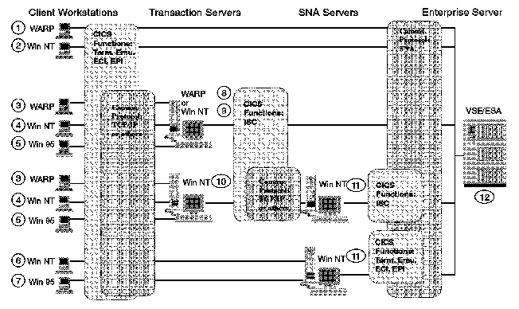

[Previous](2-3.md) | [Index](README.md) | [Next](3-0.md)

---

## 2\.4 Wrap Up

You can connect one or more CICS clients directly or through one or more Transaction Servers to CICS/VSE\. You can mix OS/2 and Windows CICS clients and Transaction Servers\. For Windows platforms you can use SNA Server to directly connect to VTAM on VSE\. Or you can establish indirect connections using the SNA Server client capabilities\.

This gives you a lot of options summarized in the figure below\.

*Figure 15\. Summary of the Connection Options\.*

---

[Previous](2-3.md) | [Index](README.md) | [Next](3-0.md)
