[Previous](4-1.md) | [Index](README.md) | [Next](4-1-2.md)

---

### 4\.1\.1 Setting up Communications

There are two ways to start installing and configuring Communications Server from CD\-ROM\.

***1\.*** Double\-click on the CD\-ROM drive icon\. Double\-click on the **\\SERVER** folder\. Double\-click on the **CMSETUP\.EXE** icon\.

***2\.*** Open an OS/2 window\. Enter **x:\\server\\cmsetup**, where x is your CD\-ROM drive\.

If you have Communications Server installed already, double\-click on the Communications Servers icon from the desktop then double\-click the Communications Manager Setup icon\.

The Communications Manager logo window and Communications Manager setup window are displayed:

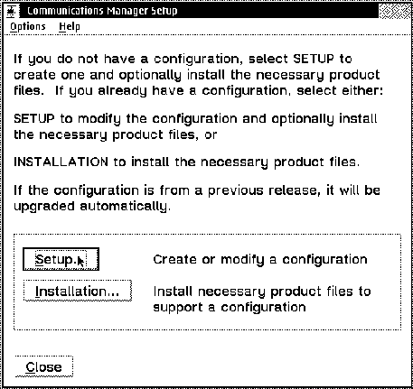

*Figure 33\. Communications Manager \- Setup Window\.*

Click on the  button to start the setup process\.

If this is not the initial installation of Communication Server/2, but it is the first time you set up an SNA connection, make sure you have the Communications Server/2 CD ready\. During the setup process it will probably be necessary to install additional product files and you will be prompted to insert the CD\.

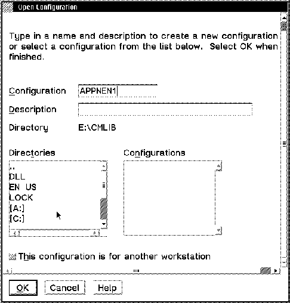

*Figure 34\. Communications Manager \- Creating a New Configuration\.*

&amp;diam\. Type a new name in the **C****onfiguration** field\.

&amp;diam\. Type a description in the **D****escription** field\.

&amp;diam\. Click on the  button\.

&amp;diam\. Select 

We need to define an APPC connection to VTAM on VSE\. In our example, we use a Token\-Ring connection\.

This is what we select on the next window\.

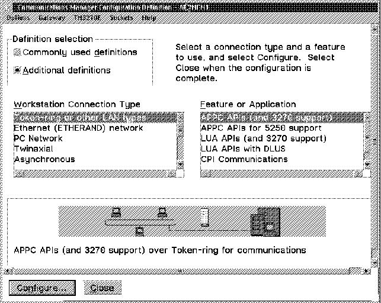

*Figure 35\. Communications Manager \- APPC Definitions\.*

&amp;diam\. Select the **Token\-ring or other LAN types** line in the **W****orkstation Connection Type** list\.

&amp;diam\. Select the **APPC APIs \(and 3270 support\)** line in the **F****eature or Application** list\.

&amp;diam\. Click on the  button\.

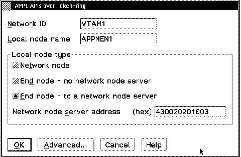

*Figure 36\. Communications Manager \- APPC APIs over Token\-ring Definition\.*

&amp;diam\. The **Network** **I****D** field must match the **NETID** field shown in [Figure 17 in topic 3\.2\.1](3-2-1.md#FIGVSEVTM1)\. &amp;diam\. Type a name in the **L****ocal node name** field\. It must be unique for each workstation within the same network\. &amp;diam\. You need to ask your systems programmer or your network administrator for the information of the **Network node** **s****erver address \(hex\)**\. In our case, the **Network node** **s****erver address** is the MAC address of the 3172 communications controller\.

&amp;diam\. Click on the  button\.

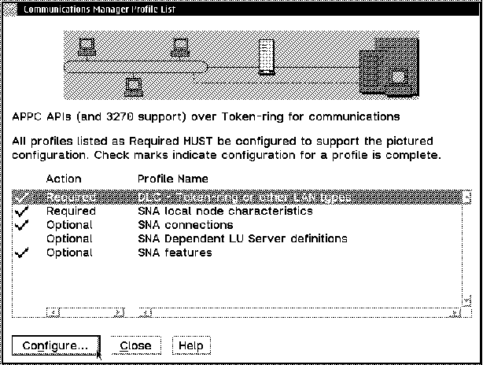

*Figure 37\. Communications Manager \- Configuring Profile List\.*

&amp;diam\. Select the **DLC \- Token\-ring or other LAN types** line\.

&amp;diam\. Click on the  button\.

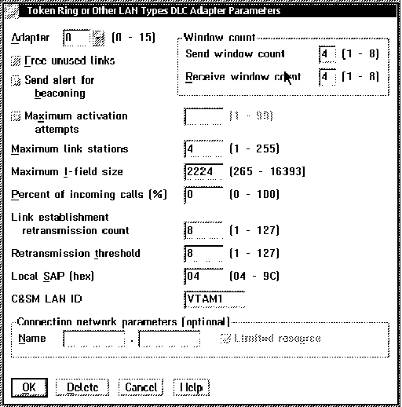

*Figure 38\. Communications Manager \- Token Ring or Other LAN Types DLC\.*

&amp;diam\. The **C&amp;SM** **L****AN ID** field must match the NETID field shown in [Figure 17 in topic 3\.2\.1](3-2-1.md#FIGVSEVTM1)\.

&amp;diam\. The **N****ame** field in **Connection network parameters \(optional\)**:

The first part should match the **C&amp;SM** **L****AN ID** defined above\.

The second part identifies virtual routing nodes communication network\. It has to be identical for all the workstations in this LAN\. It must match VNNAM in the PORT definition included in the VTAM XCA \(External Communication Adapter\) definition shown in [Figure 22 in topic 3\.2\.7](3-2-7.md#FIGVSEVTM5)\.

Click on the  button\.

You will return to [Figure 37](25.png)\. From that screen select the **SNA local node characteristics** line and click on the  button\.

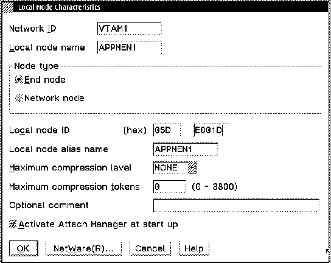

*Figure 39\. Communications Manager \- Local Node Characteristics\.*

&amp;diam\. The **L****ocal node name** must be unique for each workstation within the same network\. &amp;diam\. The two fields **Lo****c****al node ID \(hex\)** must be unique for each workstation within the same network\.

&amp;diam\. Click on the  button\.

&amp;diam\. You will return to [Figure 37](25.png)\. From that screen select the **SNA connections** line and click on the  button\.

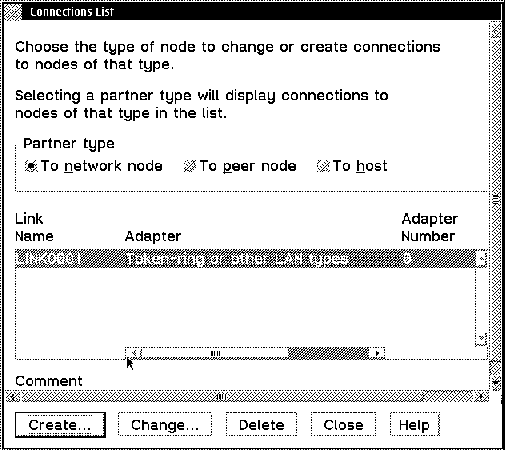

*Figure 40\. Communications Manager \- Create Connection List\.*

&amp;diam\. Select the **To** **n****etwork node** radio button\. Because our setup is based on APPN, VSE/ESA is regarded as a network node rather than a host, from the workstation point of view\.

**This is the key place where you enable the Communications Server/2 to make use of the dynamic facilities of the APPN support in VTAM for VSE\.**

&amp;diam\. Click on the 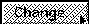 button\.

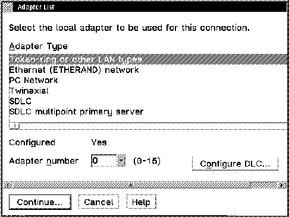

*Figure 41\. Communications Manager \- Adapter Selection\.*

&amp;diam\. Select **Token\-ring or other LAN types\.**

&amp;diam\. Click on the  button\.

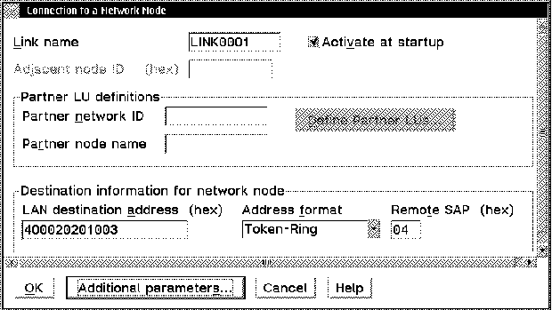

*Figure 42\. Communications Manager \- Connection to a Network Node\.*

The parameters in this window are taken from entries you made during previous definitions\. Therefore, you will normally not need to change anything here\.

&amp;diam\. Click on the  button\.

&amp;diam\. Click on the  button\.

&amp;diam\. You will return to [Figure 37](25.png)\. From that screen select the **SNA features** line and click on the  button\.

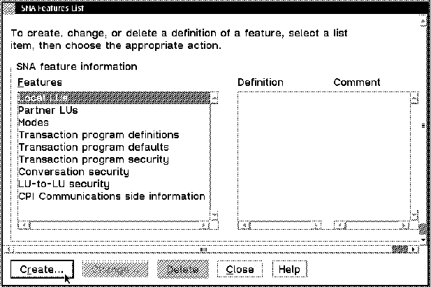

*Figure 43\. Communications Manager \- SNA Features List\.*

You will come back to this window several times to define local LUs, partner LUs, and modes\.

We start with the local LU\.

&amp;diam\. Select the **Local LUs** line in the **F****eatures** list and click on the  button\.

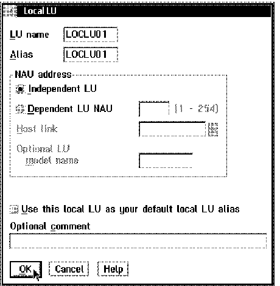

*Figure 44\. Local LU Definition\.*

&amp;diam\. **L****U name and** **A****lias** fields must match the **Local LU Name** that we defined in **CICSCLI\.INI** shown in [Figure 100 in topic 5\.2\.1](5-2-1.md#FIGCINI1) and **NetName** shown in [Figure 26 in topic 3\.3\.2\.1](<#FIGVSECIC3>)\. &amp;diam\. The default is that the LU is defined as an independent LU\. Make sure that this is not changed\.

&amp;diam\. Click on the  button\.

&amp;diam\. You will return to [Figure 43](41.png)\. At this point select **Partner LUs** from the **F****eature** list\.

&amp;diam\. Click on the  button\.

**Note:** Normally the local **L****U name** and **A****lias** will uniquely identify the workstation in the network\. In this case you need to define multiple connection/session pairs in CICS/VSE, one for each LU name, with matching **NetName** shown in [Figure 26 in topic 3\.3\.2\.1](<#FIGVSECIC3>) and **Local LU Name** as defined in **CICSCLI\.INI**, for our example shown in [Figure 100 in topic 5\.2\.1](5-2-1.md#FIGCINI1)\. We found that you can use the same Local LU name for multiple workstations\. With only a single Connection/Session definition on CICS/VSE, multiple sessions will be successfully established\. We found no problem using such links to clients with duplicate names\. \(Refer also to the note on page [3\.3\.2\.1](<#SPTSESSNT>)\)\.

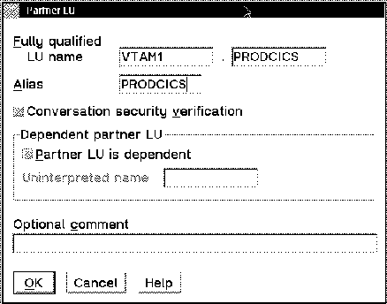

*Figure 45\. Partner LU Definition\.*

&amp;diam\. **LU name** must match the **NETID** field as shown in [Figure 17 in](3-2-1.md#FIGVSEVTM1) [topic 3\.2\.1](3-2-1.md#FIGVSEVTM1)\.

&amp;diam\. The second half of the ID name must match the **APPLID** field as shown in [Figure 19 in topic 3\.2\.4](3-2-4.md#FIGVSEVTM3)\. &amp;diam\. **ALIAS** must be equal to the same definition as the **APPLID** above\.

&amp;diam\. Click on the  button\.

&amp;diam\. You will return to the previous screen showed in [Figure 43](41.png)\. At this point, select **Modes** from the **F****eature** list and click on the  button\.

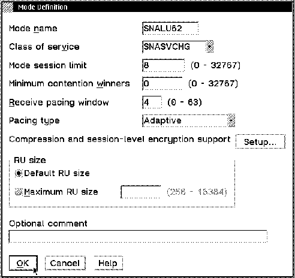

*Figure 46\. Communications Manager \- Mode Definition\.*

&amp;diam\. Type **SNALU62** in the **Mode** **n****ame** field\.

&amp;diam\. You must choose the **SNASVCMG** option from the **Class of ser****v****ice** list\.

&amp;diam\. Click on the  button\.

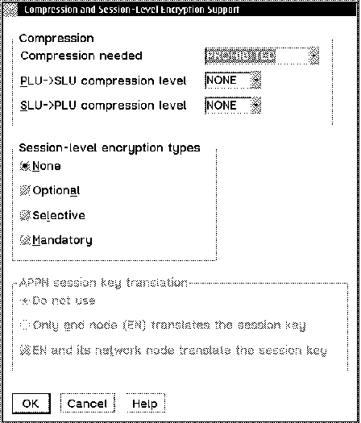

*Figure 47\. Communications Manager \- Compression and Session\.*

&amp;diam\. You must choose the **PROHIBITED** option from the **C****ompression needed\.**

&amp;diam\. Click on the  button\.

&amp;diam\. Click on the  button in the Mode Definition window\.

&amp;diam\. Click on the  button in the SNA Feature List window\.

&amp;diam\. Click on the  button in the Communication Manager Profile List window\.

&amp;diam\. Click on the  button in the Communications Manager Configuration Definition window\.

&amp;diam\. Click on the  button in the window of Communications Manager Setup window to complete the installation\.

&amp;diam\. Close the remainder of the Communication Manager windows\.

We have completed the installation and configuration of Communication Server for OS/2\.

---

[Previous](4-1.md) | [Index](README.md) | [Next](4-1-2.md)
