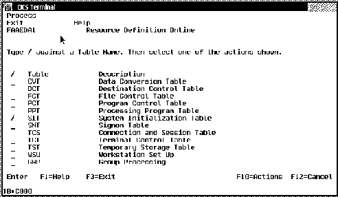
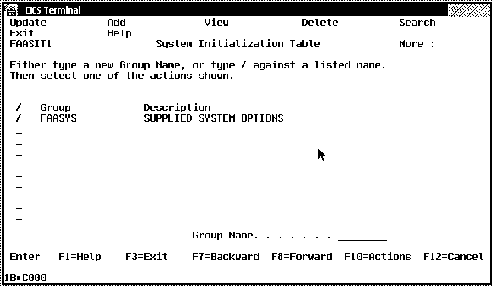
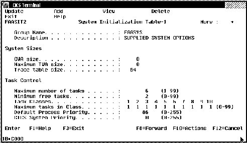
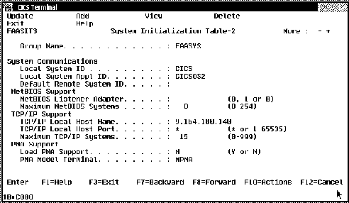
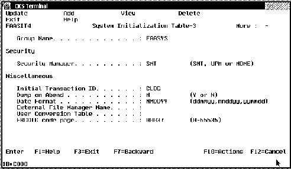
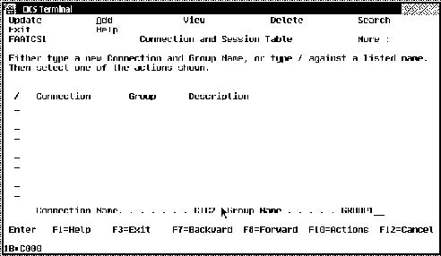
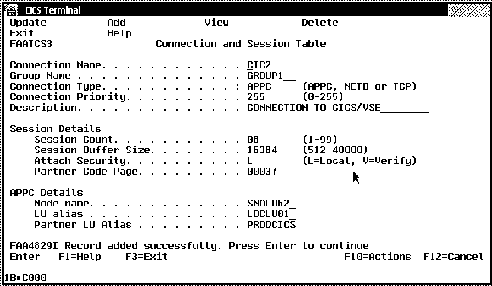

[Previous](4-1-1.md) | [Index](README.md) | [Next](4-2.md)

---

### 4\.1\.2 Setting up CICS for OS/2

There are two ways to start installing Transaction Server for OS/2 from CD\-ROM:

***1\.*** Double\-click on the CD\-ROM drive icon\. Double\-click on the **Language** folder\. Double\-click on the **INSTALL\.EXE** icon\.

***2\.*** Open an OS/2 window\. Enter **x:\\US\\INSTALL**, where x is your CD\-ROM drive and US is the English version\.

Please follow the installation description in the book **IBM Transaction Server for OS/2 Warp** ***Up and Running\!***, because the installation is very easy and not included in this book\.

After the installation is finished, you will use the CEDA transaction supplied with the product to complete the setup\.

Start the CICS Transaction Server from the icon in the CICS for OS/2 folder created during Transaction Server installation\. After CICS for OS/2 has started, you will see a window with a CICS terminal\. Sign on to the system \(Userid=**SYSAD** Password=**SYSAD**\) and enter the **CEDA** transaction\. The following window screen will be displayed\.

*Figure 48\. Transaction Server \- Resource Definition Online\.*

&amp;diam\. Select the **SIT** table and press **Enter**\.

*Figure 49\. Transaction Server \- System Initialization Table\.*

&amp;diam\. Type a new group name in the field and select the **Add** option to create a new group or type **/** against the **FAASYS** supplied group and select the **Update** option to change the system definitions\.

*Figure 50\. System Initialization Table\-1\.*

Normally nothing needs to be changed here, so:

&amp;diam\. Press **F8=Forward** to get the next screen\.

*Figure 51\. System Initialization Table\-2\.*

&amp;diam\. **Add** or **Update** all necessary parameters as in our example\. &amp;diam\. The **TCP/IP Local Host Name** must match the TCP/IP address of your workstation\.

&amp;diam\. Press **F8=Forward** to get the next screen\.

**Notes:**

1\. TCP/IP support is only used to connect CICS clients on workstations to the Transaction Server for OS/2\. It is not required to connect to CICS/VSE\. In fact, you **cannot** use it to connect to VSE/ESA\.

2\. Also note that you can define a default remote system here\. If you specify the system ID of a remote CICS system the Transaction Server for OS/2 will automatically route transactions which are not defined in its own PCT to the specified default remote system\. This remote system could be a CICS/VSE system\.

*Figure 52\. System Initialization Table\-3\.*

&amp;diam\. **Add** or **Update** all necessary parameters as in our example\. &amp;diam\. **EBCDIC code page** must be changed to the value that corresponds to the National Language of your system\.

&amp;diam\. Press **Enter** to **Add** or **Update** the record\.

&amp;diam\. Press **F3=Exit** to return to the Resource Definition Online screen, as shown in [Figure 48](58.png)\.

&amp;diam\. Select the **TCS** \(Connection and Session Table\)\.

*Figure 53\. Connection and Session Table\.*

&amp;diam\. Type the connection name on the **Connection Name** field and a group name on the **Group Name** field, select the **Add** function and press **Enter** to create a new configuration\.

**Note:** The **Connection Name** field is used as a parameter \(SYSID\) in the **CRTE** transaction\. The CRTE transaction is a CICS\-provided transactions that enables the terminal operator to invoke transaction that are owned by a connected CICS system\.

*Figure 54\. Connection and Session Table \- Details\.*

&amp;diam\. Press **Enter** to get all input fields\. &amp;diam\. **Connection Type** APPC for an LU6\.2 connection\. &amp;diam\. **Partner Code Page** should be the same Code Page used by your remote CICS system\. &amp;diam\. **APPC Mode Name** must match the **Mode Name** field shown in [Figure 46 in topic 4\.1\.1](4-1-1.md#FIGCMSVR17)\. &amp;diam\. **APPC LU Alias** must match the **LU Name** \(Local LU\) field shown in [Figure 44 in topic 4\.1\.1](4-1-1.md#FIGCMSVR13)\.

&amp;diam\. **APPC Partner LU Alias** must match the **Alias** \(Partner LU\) field shown in [Figure 45 in topic 4\.1\.1](4-1-1.md#FIGCMSVR14)\.

&amp;diam\. Press **Enter** to create the new configuration\.

---

[Previous](4-1-1.md) | [Index](README.md) | [Next](4-2.md)
