[Previous](4-2.md) | [Index](README.md) | [Next](4-2-2.md)

---

### 4\.2\.1 Setting up Communications

The installation of SNA Server 3\.0 is very easy and is documented in **Microsoft SNA SERVER*****\- Getting Started***\. Please follow all the steps described in that book\. But first check the system requirements to install the product:

&amp;diam\. Minimum of 20MB of total system RAM \(recommended\)\.

&amp;diam\. Minimum of 11MB free hard\-disk space\.

After you have completed the installation, select the **Manager** icon from the Microsoft SNA Server menu as shown below\.

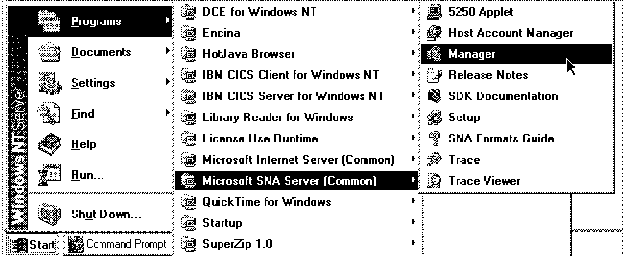

*Figure 55\. Starting SNA Server Manager\.*

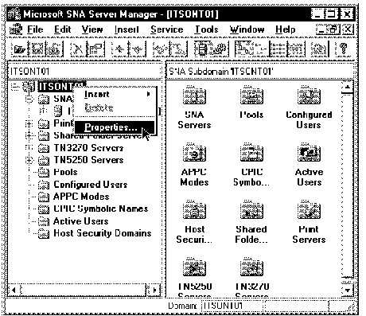

*Figure 56\. Microsoft SNA Server Manager Window\.*

&amp;diam\. From the **Microsoft SNA Server Manager** Window select the icon with the name of the workstation where you have installed the SNA Server \(right mouse button\)\.

&amp;diam\. Select **Properties** to set up the common definitions for the SNA Server \(left mouse button\)\.

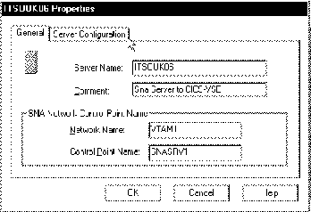

*Figure 57\. Server Properties \- General\.*

&amp;diam\. The **N****etwork Name** field must match the **NETID** field shown in [Figure 17 in topic 3\.2\.1](3-2-1.md#FIGVSEVTM1)\. &amp;diam\. Type a name in the **Control** **P****oint Name** field\. It must be unique for each server within the same network\.

&amp;diam\. Select the **Server Configuration** panel\.

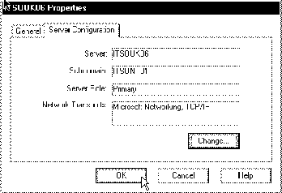

*Figure 58\. Server Properties \- Server Configuration\.*

&amp;diam\. Please consult HELP for information about the settings\.

&amp;diam\. Click on the  button\.

&amp;diam\. You will return to [Figure 56](66.png)\.

&amp;diam\. Select the same **SNA Server** workstation again \(right button\)\.

&amp;diam\. Select **I****nsert** and **Link Service\.\.\.** \(left button\)\.

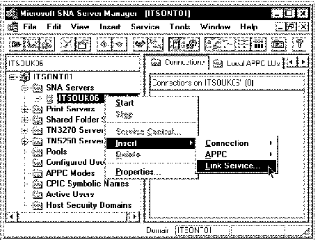

*Figure 59\. Link Service\.*

This will give you a list of link services from which you can select the one you need\.

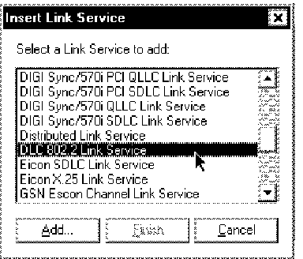

*Figure 60\. Insert Link Service\.*

&amp;diam\. Select from the list **DLC 802\.2 Link Service** for Token\-Ring\.

&amp;diam\. Click on the  button\.

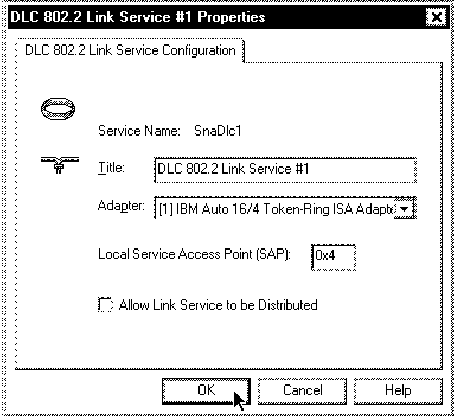

*Figure 61\. DLC 802\.2 Link Service Properties\.*

&amp;diam\. Click on the  button\.

&amp;diam\. Click on the 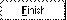 button\.

&amp;diam\. You will return to [Figure 56](66.png)\.

&amp;diam\. Select the same **SNA Server** workstation again \(right button\)\.

&amp;diam\. Select **I****nsert** and **Connections** and **802\.2** \(left button\)\.

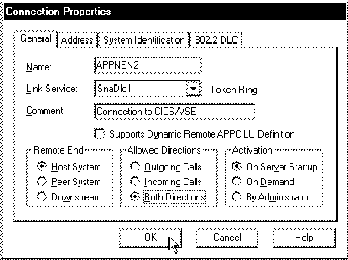

*Figure 62\. Connection Properties \- General\.*

&amp;diam\. Type the Connection Name in the **N****ame** field\. &amp;diam\. Select the **SnaDlc1** line in the **L****ink Service** list\.

&amp;diam\. Select **Host System** option\.

&amp;diam\. Select **Both Directions** option\.

&amp;diam\. Select the **Address** panel\.

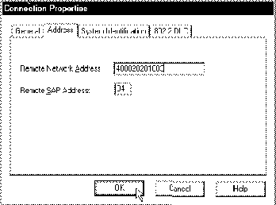

*Figure 63\. Connection Properties \- Address\.*

&amp;diam\. You need to ask your systems programmer or your network administrator for information about the **Remote Network** **A****ddress**\. In our case, the **Remote Network** **A****ddress** is the MAC address of the 3172 communications controller\.

&amp;diam\. Select the **System Identification** panel\.

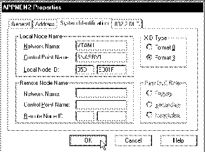

*Figure 64\. Connection Properties \- System Identification\.*

&amp;diam\. Check the following: **N****etwork Name** field \(inserted automatically\)\. **C****ontrol Point Name** field \(inserted automatically\)\. &amp;diam\. The two fields in **Lo****c****al node ID \(hex\)** must be unique for each server within the same network\. This parameter must match the IDBLK and IDNUM in the **VTMSWNET** Switched Major node shown on [Figure 21 in topic 3\.2\.6](3-2-6.md#FIGSWMJ01)\.

&amp;diam\. Select the **802\.2 DLC** tab\.

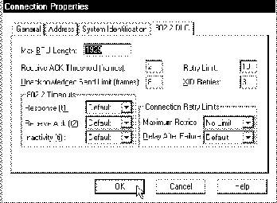

*Figure 65\. Connection Properties \- 802\.2 DLC\.*

&amp;diam\. You should normally not need to change anything here\. Please use HELP for information about the settings\.

&amp;diam\. Click on the  button\.

&amp;diam\. You will return to [Figure 56](66.png)\.

&amp;diam\. Select the same **SNA Server** workstation again \(right button\)\.

&amp;diam\. Select **I****nsert** and **APPC** and **Local LU** \(left button\)\.

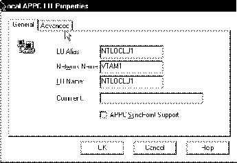

*Figure 66\. Local APPC LU Properties \- General\.*

&amp;diam\. The **LU** **A****lias** field is a name that identifies an APPC LU to Local Transactions Programs\. &amp;diam\. The **Net****w****ork Name** field must match the **NETID** name shown on [Figure 17 in topic 3\.2\.1](3-2-1.md#FIGVSEVTM1)\. &amp;diam\. The **L****U Name** field must match the Independent LU definition shown on [Figure 21 in topic 3\.2\.6](3-2-6.md#FIGSWMJ01) and the Netname in the session definition of CICS/VSE \(see ["Defining Connection and Sessions](3-3-2.md) [Parameters to CICS/VSE" in topic 3\.3\.2](3-3-2.md)\)\.

**Note:** In the tested version of SNA Server, the LU Alias and the LU Name must match\.

&amp;diam\. Select the **Advanced** panel\.

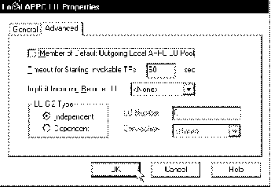

*Figure 67\. Local APPC LU Properties \- Advanced\.*

&amp;diam\. Select the **I****ndependent** LU 6\.2 Type\.

&amp;diam\. Click on the  button\.

&amp;diam\. You will return to [Figure 56](66.png)\.

&amp;diam\. Select the same **SNA Server** workstation again \(right button\)\.

&amp;diam\. Select **I****nsert** and **APPC** and **Remote LU** \(left button\)\.

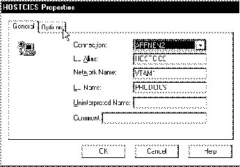

*Figure 68\. Remote APPC LU Properties \- General\.*

&amp;diam\. Select the appropriate **Connec****t****ion** from the listbox\. &amp;diam\. The **LU** **A****lias** field is the name under which the application program uses this connection\. &amp;diam\. The **Net****w****ork Name** field must match the **NETID** name shown on [Figure 17 in topic 3\.2\.1](3-2-1.md#FIGVSEVTM1)\. &amp;diam\. The **L****U Name** field must match the LU Name under which CICS/VSE is known in the Network shown on [Figure 19 in topic 3\.2\.4](3-2-4.md#FIGVSEVTM3)\.

&amp;diam\. Select the **Options** panel\.

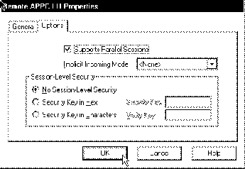

*Figure 69\. Local Remote APPC LU Properties \- Options\.*

&amp;diam\. Tick the **S****upports Parallel Sessions**\.

&amp;diam\. Click on the  button\.

&amp;diam\. You will return to [Figure 56](66.png)\.

&amp;diam\. Select the **SNA Server** folder \(right button\)\.

&amp;diam\. Select **I****nsert** and **APPC** and **Mode Definition** \(left button\)\.

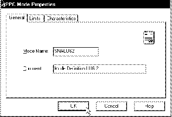

*Figure 70\. APPC Mode Properties \- General\.*

&amp;diam\. Type in the **M****ode Name** field the same **Modename** as defined in the CICS Session definition shown in [Figure 27 in topic 3\.3\.2\.1](<#FIGCICSSES>)\.

&amp;diam\. Select the **Limits** panel\.

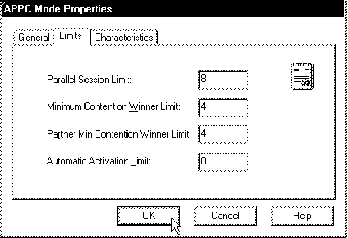

*Figure 71\. APPC Mode Properties \- Limits\.*

&amp;diam\. The **P****arallel Session Limit** and the **Minimum Contention** **W****inner Limit** must match the **MAximum** field definition in the CICS Session definition shown in [Figure 27 in topic 3\.3\.2\.1](<#FIGCICSSES>)\.

&amp;diam\. Select the **Characteristics** panel\.

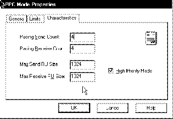

*Figure 72\. APPC Mode Properties \- Characteristics\.*

&amp;diam\. The **Ma****x** **Send RU Size** and the **Max Receive R****U** **Size** must match the **SENDSize** and the **RECEIVESize** field definition in the CICS Session definition shown in [Figure 27 in topic 3\.3\.2\.1](<#FIGCICSSES>)\.

&amp;diam\. Click on the  button\.

&amp;diam\. You will return to [Figure 56](66.png)\.

&amp;diam\. Select the **SNA Server** workstation again \(right button\)\.

Your definitions are now complete\. You can now start the SNA Server:

&amp;diam\. Select **S****tart** to start the server to activate the communication \(left button\)\.

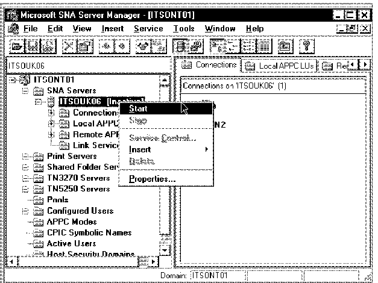

*Figure 73\. SNA Server Start\.*

---

[Previous](4-2.md) | [Index](README.md) | [Next](4-2-2.md)
