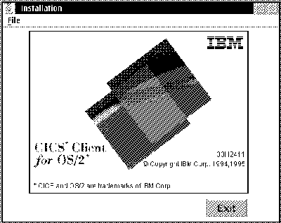
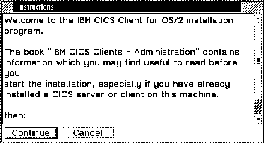
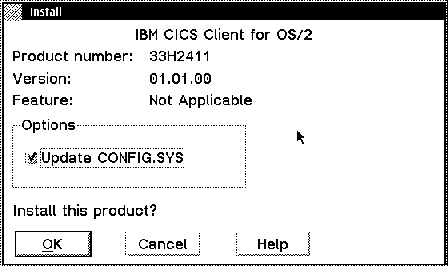
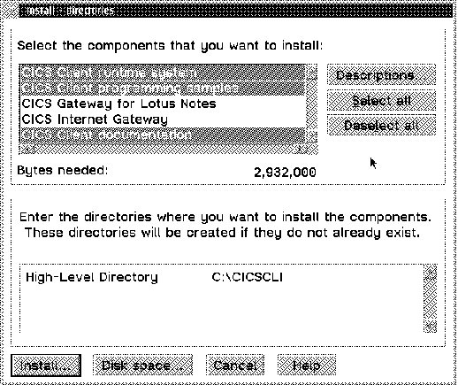
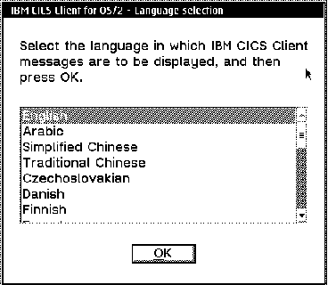
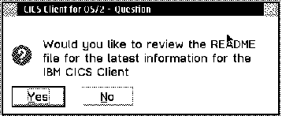
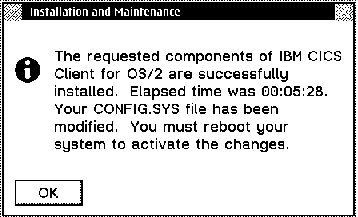

[Previous](5-0.md) | [Index](README.md) | [Next](5-2.md)

---

## 5\.1 CICS Client Installation

You can obtain IBM CICS Clients as part of the Transaction Server product, which packages CICS for OS/2 and CICS clients together on a CD\-ROM\. The Transaction Server CD\-ROM contains a \\CLIENTS directory with subdirectories of \\DOS, \\OS2 and \\WIN\.

You can install CICS clients from the Transaction Server CD\-ROM by:

1\. Installing directly from the Transaction Server CD\-ROM

2\. Installing from the CD\-ROM drive on the server

3\. Installing from the hard disk of a remote machine

4\. Installing from diskette\.

The installation program runs in the same way as described for the individual clients in this topic\.

Execute the program named **INSTALL\.EXE** from the installation media\. For example, if you install from Transaction Server for OS/2 Warp, run **x:\\clients\\os2\\install\.exe**\.

*Figure 92\. CICS Client for OS/2 \- Installation\.*

*Figure 93\. CICS Client for OS/2 \- Instructions\.*

Click on the  button\.

*Figure 94\. CICS Client for OS/2 \- Install\.*

Make sure you check the 'UPDATE CONFIG\.SYS' option

- Click on the  button\.

*Figure 95\. CICS Client for OS/2 \- Installing Directories\.*

- Select the components that you want to install\. The minimum you must select is the CICS Client runtime system\.
- If you want to change the default disk or directory click on the **Dis****k** **space\.\.\.** button, otherwise click on the  button\.

*Figure 96\. CICS Client for OS/2 \- Language Selection\.*

Check the language you want from the list\.

- Click on the  button\.
- When the installation is finished, a prompt window will pop up\.

*Figure 97\. CICS Client for OS/2 \- Question\.*

Click on the  button\. The 'readme' file will be displayed\. Close the 'readme' file, after you have read it\.

*Figure 98\. CICS Client for OS/2 \- Installation and Maintenance\.*

- Click on the  button\.
- Don't forget to restart your system\.

Now you have completed the installation of the CICS Client for OS/2 Warp\.

---

[Previous](5-0.md) | [Index](README.md) | [Next](5-2.md)
