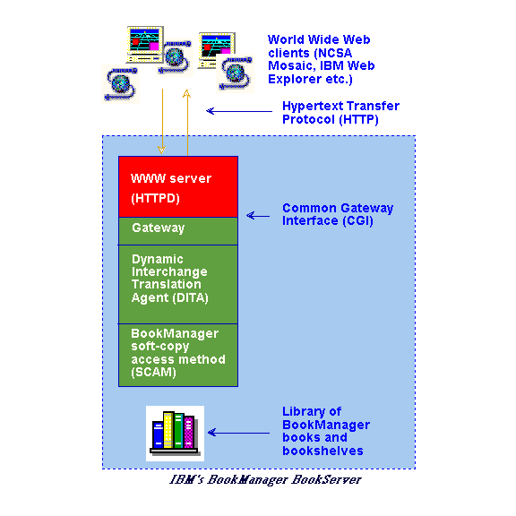

[Previous](1-2.md) | [Index](README.md) | [Next](1-4.md)

---

## 1\.3 How BookServer works

As shown in [Figure 2](2.png), IBM BookManager BookServer is a specialized World Wide Web server that enables customers to provide libraries of BookManager books, bookshelves and bookcases via the Internet World Wide Web\. The text of books is translated dynamically \(no preparation or other special treatment of the books is necessary\) into HTML\. Internal pictures are translated into GIF\.

High\-performance searching of books and bookshelves is performed at the server, with the results returned to the client\.

*Figure 2\. Structure of IBM BookManager BookServer\.*

---

[Previous](1-2.md) | [Index](README.md) | [Next](1-4.md)
